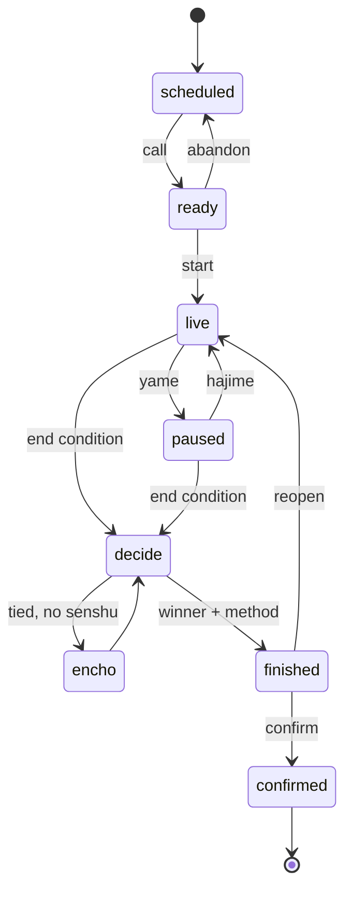
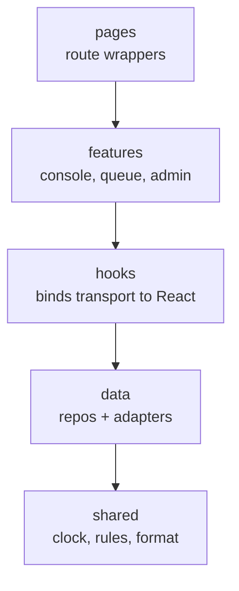
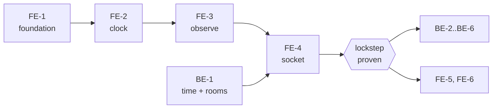

# Kumite Scoring System — PRD

As of 2026-09-19

## Overview

We are building a WKF-style kumite tournament system: the live match console a referee drives, judge devices that mirror it exactly, a public scoreboard, and the admin tooling around them.

### Scope

| In scope | Out of scope |
| --- | --- |
| Kumite match scoring and match control | Kata scoring — parked, not deleted |
| Referee console, judge view, public scoreboard | Native mobile app — separate codebase and language |
| Tournaments, categories, athletes, entries, draws | Registration portal, payments, streaming |
| Results, standings, CSV export | Multi-tenant hosting for many clubs |

### Roles

| Role | Can do |
| --- | --- |
| Admin | Tournaments, categories, athletes, entries, draws, mat assignment, export |
| Referee | Runs the console for matches on their mat; one device controls a mat at a time |
| Judge | Sees the identical console read-only, above all the same clock |
| Display | Unauthenticated public scoreboard for one mat |

### The one hard requirement

The referee and every judge must see the same clock, to the second, at all times.

Everything else here is ordinary application work. This requirement shapes the architecture because the obvious solutions both fail. Broadcasting the ticking number leaves every judge a different network hop behind. Letting each device run its own `setInterval` guarantees visible disagreement inside a single bout, because timers drift and browsers throttle background tabs.

### Stack

| Layer | Choice |
| --- | --- |
| Web client | React + Vite + MUI (existing app) |
| Live transport | Node.js + Socket.IO |
| Durable storage | MongoDB |
| Shared logic | Plain JS modules imported by both client and server |

Node was chosen over Firebase for data ownership, no free-tier quota wall, and server-authoritative state. The accepted cost is that auth, reconnection and deployment are ours to build. Because it is JavaScript on both ends, the clock and rules modules are the same files in the browser and on the server, so the two cannot drift apart.

## Workflow

A bout travels from the admin's draw to a confirmed result in eleven steps, and the result is locked in two of them, not one.

### Match day, end to end

1. Admin publishes the day: categories assigned to mats, running order set.
2. Referee opens the app, picks a mat, and sees the queue of upcoming bouts with bib, name and club.
3. Referee calls bout 1. Status becomes `ready`; the mat display shows the two names.
4. Athletes step on. Referee starts the match, claims control of the mat, and the clock loads from the category rules.
5. Hajime starts the clock. Scores and penalties are entered; judge devices and the display follow.
6. Yame stops the clock. Every start and stop is recorded as an event.
7. If a score creates an 8-point gap, the engine flags the bout ended and the console asks to confirm.
8. Otherwise time expires, and the engine decides by score, then senshu, then encho or hantei per that category's policy.
9. Referee confirms winner and method. Status becomes `finished` and the scores lock.
10. Tatami manager confirms. Status becomes `confirmed`, the winner is written into the next bracket slot, and the next bout goes `ready`.
11. Display flashes the winner, then swaps to the next bout.

### Why finishing and confirming are separate

Between `finished` and `confirmed` the result is visible but nothing has cascaded into the bracket. A mis-tapped Close is a one-click correction instead of unpicking a round. The current prototype finalises and navigates away in a single step, which is the risk this split removes.

### Match state machine



A bout reaches `decide` through one of five conditions, and the engine reports which one.

| Condition | Outcome method |
| --- | --- |
| Time expires, one side ahead | `points` |
| Time expires, level | `senshu`, then `encho` or `hantei` per policy |
| Point gap reached | `gapRule` |
| Penalty ladder reaches its top | `hansoku` |
| Disqualification | `shikkaku` |
| Withdrawal or no-show | `kiken` |

### Who may drive a mat

One device controls a mat at a time. The server holds the controller for each mat and answers every other device read-only. Socket.IO reports a disconnect immediately, so control frees itself when a phone drops, with no heartbeat protocol to maintain.

This matters because the current prototype has the opposite behaviour: open the same match in two tabs and both run their own clock and both write, so the time jumps and scores can be lost.

## Shared core

The clock is not replicated state — it is a pure function of time, so we sync its three parameters and let every device render locally. A three-minute bout with four stoppages is about ten writes, not five hundred.

### The clock anchor

```javascript
Clock = {
  running:     boolean,
  remainingMs: number,        // remaining as of the last stop
  startedAt:   number | null, // SERVER time when it started
}

remainingNow(clock, serverNow) =
  clock.running
    ? Math.max(0, clock.remainingMs - (serverNow - clock.startedAt))
    : clock.remainingMs
```

Hajime writes `{running: true, remainingMs: <current>, startedAt: serverNow()}`. Yame writes `{running: false, remainingMs: <computed>, startedAt: null}`. Nothing is transmitted in between.

Every device re-renders on its own 100 ms interval and recomputes from the anchor each time. Because it samples a function instead of counting ticks, a render that fires 300 ms late still shows the right number — which is exactly why timer drift and tab throttling stop mattering.

### What this buys

| Situation | Result |
| --- | --- |
| Judge joins mid-bout | Correct immediately |
| 320 ms network latency | Correct, not 320 ms behind |
| Phone sleeps or locks | Correct on wake — recomputed, not resumed |
| Network drops mid-round | Still correct; nothing changes between start and stop |
| Connection returns | Correct immediately, no accumulated drift |
| Referee's Yame fails to send | The only real divergence case |

That last row is handled with a heartbeat: the controlling device publishes a timestamp every two seconds, and a judge screen that has heard nothing for five seconds dims the clock and marks it not live. A clock that is wrong but confident is the failure to avoid.

### Agreeing on "now"

Deriving from `startedAt` only works if devices agree what time it is, and phone clocks are routinely seconds out. Each client runs an NTP-style handshake over the socket on connect and every 30 seconds after.

```latex
\text{offset} = \frac{(t_1 - t_0) + (t_2 - t_3)}{2}
\qquad
\text{delay} = (t_3 - t_0) - (t_2 - t_1)
```

Run it five times, keep the sample with the lowest delay, then `serverNow() = Date.now() + offset`. On a LAN this lands inside ±20 ms, so devices flip each second within a fraction of a second of each other.

### The rounding trap

If one app floors and another ceils, two devices agreeing perfectly on the milliseconds still display different seconds. One shared `formatClock(ms)`, used by every client and the server, no exceptions.

### Rules as policy

Regulations differ by federation, age group and rule revision, so the engine reads a config resolved per category rather than hard-coding any of it.

```javascript
{
  duration: 180,              // seconds
  extraTime: 60,              // encho, 0 = none
  pointGap: 8,                // 0 = disabled
  senshu: true,
  senshuCancelledBy: [...],   // which penalties void it
  penaltyCategories: 2,
  penaltyLadder: ['C','K','HC','H'],
  tieBreak: 'senshu|encho|hantei',
  koTimer: 180,
}
```

The engine surface is small and pure — no React, no IO, no network:

```javascript
awardPoint(state, side, 'ippon' | 'wazaAri' | 'yuko')
applyPenalty(state, side, category, level)
startClock(state, serverNow) / stopClock(state, serverNow) / adjustClock(state, delta)
evaluateOutcome(state, rules) -> { ended, winner, method }
```

The UI never decides an outcome. It renders what the engine returns and asks the referee to confirm.

**Open question:** the values in that config — durations per age group, tie-break order, and what cancels senshu — need to come from you. They are deliberately not guessed here.

## Frontend PRD

The client is four layers with dependencies pointing only downward, and the rule that carries the whole design is that no component ever touches storage or a socket directly.

### Layers



`shared` imports nothing from the app and runs on the server too. `data` knows transport but not React. `hooks` is the only bridge between them. Today every page reads `localStorage` inline, which is what made the transport choice feel risky; this removes that coupling.

### Structure

```
src/
  shared/           clock.js  rules.js  format.js  constants.js
  data/
    repo.js         tournamentRepo, matchRepo, eventRepo
    adapters/       local.js (dev)   socket.js (real)
  state/            SessionContext    ConnectionContext
  hooks/            useServerNow  useMatchClock  useMatch  useMatchQueue
  features/
    console/        Console  ScorePanel  ClockPanel  PenaltyRow
                    ConfirmGuard  useConsoleActions
    queue/  admin/  display/
  pages/
  theme/wkf.js
```

### State model

No Redux. Three tiers, each with one job.

| Tier | Holds | Lives in |
| --- | --- | --- |
| Server state | Match, clock, scores, queue | Hooks over `subscribe()` |
| Session state | User, role, token, connection, clock offset | Context |
| Local UI state | Dialog open, draft input | `useState` |

The constraint that makes judges and referee agree: the referee's device does not own match state. It dispatches commands and renders what comes back, applying only score taps and clock start/stop optimistically, reconciled when the event returns. Both sides therefore render one projection instead of two implementations that agree by luck.

### The console

One component, two modes:

```jsx
<Console mode="control" />   // referee
<Console mode="observe" />   // judges, display
```

Same layout, same clock, buttons inert in observe mode. That is how judges get an identical view without a second implementation that can drift.

`ConfirmGuard` already exists and stays: while the clock runs, Reset time, Extra time, 60 seconds, KO Timer, the scoreboard toggle, field number and Close all require confirmation. Scoring and Stop never do.

### Clock hooks

```javascript
useServerNow()           // Date.now() + offset from ConnectionContext
useMatchClock(matchId)   // -> { running, remainingMs, display }
```

Console, judge view and scoreboard all call the same hook, so they agree by construction rather than by discipline.

### Non-functional requirements

| Requirement | Target |
| --- | --- |
| Clock agreement across devices | Within 200 ms |
| Score tap to judge screen | Under 300 ms on a LAN |
| Console readable across a hall | Score digits at least 72 px |
| Recovery after a crash or reload | Full state, clock still running |
| Stale-connection warning | Within 5 seconds |
| Theming | Palette as tokens in one file |

## Frontend phases

FE-1 through FE-3 need no server at all — the local adapter carries them, so the client can be finished and proven before any backend exists.

| Phase | Scope | Exit test |
| --- | --- | --- |
| **FE-1** Foundation | Create the layers. Move clock and rules into `shared/`. Repos + local adapter. Migrate legacy `matches-<id>` keys to flat collections. Rewire the console. | App behaves exactly as today, all tests green, no component touches storage |
| **FE-2** Clock | `useServerNow` and `useMatchClock`. The anchor model replaces the interval counter. | Two tabs show the same second, and both survive reload and sleep |
| **FE-3** Observe + display | `mode="observe"`, `/display/:mat` scoreboard, staleness indicator | Four windows, one controlling and three observing, all identical |
| **FE-4** Socket adapter | `adapters/socket.js` behind the same interface, session and JWT, reconnect and resync by `seq` | Referee and judges on real devices tick in lockstep |
| **FE-5** Match flow | `ready → live → finished → confirmed`, outcome dialog from `evaluateOutcome`, undo from the event log | A full bout run start to confirmed result |
| **FE-6** Admin and queue | Athletes, entries, mat queue, draw, standings, export | A category run to a winner |

### FE-1 in detail

This phase is invisible to users and is the one that makes every later phase cheap, so it is worth spelling out.

- [ ] Create `shared/clock.js` with `remainingNow`, `startClock`, `stopClock`, `adjustClock`
- [ ] Create `shared/format.js` with the single `formatClock`
- [ ] Move scoring, penalties and outcome logic into `shared/rules.js`
- [ ] Unit tests for both, with no React and no network
- [ ] Define the repo interface and build the localStorage adapter behind it
- [ ] Namespace keys as `kt:v1:*` and flatten collections
- [ ] Write `migrate.js` for existing data
- [ ] Rewire the console and the referee pages to repos
- [ ] Confirm the existing test suite still passes unchanged

The adapter methods are async from the start, even on localStorage. Synchronous call sites are exactly what makes this kind of migration painful later.

## Backend PRD

The server owns live match state. Clients send commands describing intent; the server validates them, stamps its own time, and broadcasts events describing fact.

### Structure

```
server/
  index.js          express + socket.io
  auth/             jwt.js  middleware.js (http + socket handshake)
  time/sync.js      ping/pong, server timestamps
  realtime/
    gateway.js      socket wiring, rooms, auth
    matchRoom.js    authoritative per-match state machine
    registry.js     active rooms, mat control
  domain/ -> ../shared   the SAME clock.js and rules.js the client imports
  db/               mongo.js, models/
  api/              REST CRUD
  services/         matchService, drawService
```

### Authority

One `MatchRoom` per active match, held in memory:

```javascript
class MatchRoom {
  state         // clock, scores, senshu, penalties, period, status
  controllerId  // the referee socket driving this mat
  seq           // monotonic event counter
  apply(cmd, actor) -> events   // validate, mutate, return facts
}
```

The server stamps every timestamp and assigns every `seq`, then broadcasts to the room and appends to MongoDB. After a restart, rooms rebuild by replaying `matchEvents`. No client clock is ever trusted for anything that matters.

### Protocol

```
→  time:ping         { t0 }
←  time:pong         { t0, t1, t2 }
→  match:join        { matchId }
←  match:snapshot    { state, seq }
→  match:cmd         { matchId, cmd, payload, clientEventId }
←  match:event       { evt, seq, ... }
←  match:control     { controllerId }
```

`clientEventId` makes commands idempotent, so a retry after a dropped connection cannot double-score. On reconnect a client sends its last `seq`, and the server either replays the gap or sends a fresh snapshot if the gap is large.

Commands in the first cut: `CLOCK_START`, `CLOCK_STOP`, `CLOCK_ADJUST`, `CLOCK_SET`, `KO_TIMER`. Scoring commands arrive in BE-3.

### Data model

Flat collections with parent-id fields, which query cleanly and map onto permissions.

| Collection | Key fields | Notes |
| --- | --- | --- |
| `tournaments` | name, venue, dates, status, matCount, defaults | Rule defaults live here |
| `categories` | tournamentId, name, gender, ageGroup, weightClass, rules | Overrides tournament defaults |
| `athletes` | tournamentId, name, bib, club, country, dob, gender | Tournament level, not per category |
| `entries` | categoryId, athleteId, seed, status | Lets one athlete enter several categories |
| `matches` | categoryId, mat, round, position, akaEntryId, aoEntryId, order, status, result, nextMatchId, nextSlot | `nextMatchId` drives bracket progression |
| `matchEvents` | matchId, seq, ts, type, side, value, operatorId, undone | Append-only; the audit trail and undo |

Indexes: `matches` on `{categoryId, mat, status}`, `matchEvents` on `{matchId, seq}`.

Athletes moving up to tournament level is a change from the prototype, where a competitor entering two categories is stored twice.

### Auth

JWT with the role in the token, verified on the HTTP middleware and again in the socket handshake. Mat assignment is checked per command, so a referee cannot drive a mat they are not assigned to.

### Write volume

Eight mats at ten bouts an hour and roughly thirty events a bout is about 2,400 writes an hour. The only thing that could have been expensive was a per-second clock, and the anchor model removes it.

## Backend phases

BE-1 deliberately has no database, because the point of the first milestone is to prove the shared clock before any persistence work is built on top of it.

| Phase | Scope | Exit test |
| --- | --- | --- |
| **BE-1** Time + rooms | express + socket.io, time handshake, in-memory match rooms, the five clock commands. No database. | Referee and three judges tick in lockstep; kill one, reconnect, it lands on the right second |
| **BE-2** Persistence | Mongo models, append-only event log, room rebuild on restart | Restart the server mid-bout and lose nothing |
| **BE-3** Scoring | Score, penalty and senshu commands through `shared/rules.js`; outcome evaluated server-side | An 8-point gap and a hansoku each end the bout automatically |
| **BE-4** Auth and roles | JWT, socket handshake auth, mat assignment, control enforcement | A second device on the same mat gets read-only |
| **BE-5** REST CRUD | Tournaments, categories, athletes, entries, matches | An admin can set up a tournament end to end |
| **BE-6** Lifecycle and bracket | finish and confirm, winner advancement in a transaction, standings | A category runs through to a winner |

### BE-1 in detail

- [ ] express + socket.io skeleton, one room per match
- [ ] `time:ping` / `time:pong` handshake returning server timestamps
- [ ] `MatchRoom` holding clock state in memory, importing `shared/clock.js`
- [ ] The five clock commands, validated and stamped server-side
- [ ] `seq` per room, snapshot on join, replay on reconnect
- [ ] Controller tracking with release on socket disconnect
- [ ] A throwaway test page: one control window, three observers

If BE-1 passes its exit test, the core requirement is solved and everything after it is ordinary application work.

### Deployment

Worth deciding before BE-2 rather than discovering at BE-5: MongoDB Atlas M0 is free and ample for this data, but free Node hosts sleep and cold-start, so the server realistically wants a small VPS or a machine at the venue.

## Sequencing and open items

FE-4 meeting BE-1 is the integration milestone — the moment the real requirement is proven. Everything before it runs on the local adapter, and everything after it is ordinary application work.



FE-1 to FE-3 and BE-1 can run in parallel. Start with FE-1: it is invisible to users but it is what makes every later phase cheap.

### Open decisions

| # | Decision | Why it matters |
| --- | --- | --- |
| 1 | Rule values — durations per age group, tie-break order, what cancels senshu | Blocks the rules config in FE-1 |
| 2 | Do judges only observe, or do they signal points with a majority rule? | Turns the judge app from a viewer into a scoring client; changes BE-3 substantially |
| 3 | How many judges per match, and what agreement threshold? | Only needed if judges signal |
| 4 | Does the referee confirm results, or a separate tatami manager? | Decides whether `confirmed` needs a second person and role |
| 5 | One mat or many, for now? | Single mat makes the queue and control model much simpler |
| 6 | Where the server runs on match day | Needed before BE-2 |

### Risks

| Risk | Mitigation |
| --- | --- |
| Venue network worse than expected | The anchor clock keeps working between start and stop; only a missed start or stop diverges |
| Single Node process is a point of failure | Event log plus fast rebuild; restart is seconds, not a lost bout |
| Rule changes between federations or revisions | Rules are config per category, not code |
| Referee mis-taps under pressure | Confirm guard while the clock runs, plus undo from the event log |
| Prototype data left behind | `migrate.js` in FE-1, versioned `kt:v1:*` keys |

### Decided already

- Kumite only; kata parked but not deleted.
- Node, MongoDB and Socket.IO over Firebase, for data ownership and no quota wall.
- The console colours are sampled from the reference WKF console and live as tokens.
- Scoring is never blocked by a confirmation; Stop is not either.
