# Karate Tournament App — Operator Handbook

_Last updated 10 October 2026._

## Contents

- [How to use this handbook](#how-to-use-this-handbook)
- [1. Before you start](#1-before-you-start)
- [2. Sign in and find your way around](#2-sign-in-and-find-your-way-around)
- [3. The plan](#3-the-plan)
- [4. Part 1 — Set up the tournament](#4-part-1--set-up-the-tournament)
- [5. Part 2 — Registration](#5-part-2--registration)
- [6. Part 3 — Weigh-in, lock and draw](#6-part-3--weigh-in-lock-and-draw)
- [7. Part 4 — Prepare the day](#7-part-4--prepare-the-day)
- [8. Part 5 — Competition day](#8-part-5--competition-day)
- [9. Part 6 — Results and finishing](#9-part-6--results-and-finishing)
- [10. Checklists to print](#10-checklists-to-print)
- [11. When something goes wrong](#11-when-something-goes-wrong)
- [12. Words you will see](#12-words-you-will-see)

## How to use this handbook

This handbook teaches you to run a karate tournament on the app, even if you have never seen it before. Read it once from start to end, then keep it open beside you and do the jobs in order.

- Every job is a list of numbered steps. Do step 1, then step 2, and so on.
- Words in **bold** are the exact words you will see on a button, tab or box.
- Each picture shows the screen you should see. A numbered marker shows where to click. The same number appears in brackets in the steps, like (1).
- Each job ends with **Done when**: how you know it worked.
- Opening pages and tabs changes nothing, so you can look around freely.

Not every job may be yours. If someone else sets up the tournament, start at Part 5 (competition day). Section 10 has checklists to print, and section 11 says what to do when something goes wrong. The full [User Guide](../user-guide/README.md) lists every rule and message, for when you need more detail.

## 1. Before you start

The app runs the whole tournament for you: entries, draw, bouts, scores, results and certificates. It is a website, so there is nothing to install. You open it in a web browser and sign in.

### What the app does for you

- Coaches enter their own players online, through a link you send them.
- It puts each player in the right category by age, gender and, for Kumite, weight.
- It draws the pools and makes the list of bouts, each with a number (M-001, M-002 …).
- On the day, the referee scores each bout on a tablet, and the TV screens in the hall show the score.
- It works out the winners and medals, makes certificates, and gives you reports to download.

### What you need

| What | Why |
| --- | --- |
| A laptop or desktop computer with Google Chrome (Edge, Firefox or Safari also work) | You run the tournament from it |
| The app's web address, for example karate.yourclub.in | Ask the person who installed the app |
| Your email and password | There is no sign-up. The administrator makes your account |
| Internet at the venue, for every device | Every screen talks to the app over the internet. Test the venue Wi-Fi the day before |
| One tablet or laptop for each mat | The referee scores Kumite bouts on it |
| One phone or tablet for each kata judge | Judges enter their kata scores on it (a panel has 5 judges unless you change it) |
| A TV or monitor for each mat, with a web browser (optional) | Shows the score to the hall |
| A printer (optional) | For passes, draw sheets and certificates |

### Who does what on competition day

| Person | What they do | Screen they use |
| --- | --- | --- |
| You, the **Tournament Admin** | Run everything and fix problems | Every tab of the tournament |
| **Registration Officer** | Checks and approves the entries | Registrations |
| **Weigh-in Officer** | Weighs the Kumite players | Weigh-in |
| **Announcer** | Calls the next bouts to each mat | Call matches |
| **Referee**, one at each mat | Scores the Kumite bouts | The scoring console |
| **Kata Judges** | Score each kata performance | Kata scoring |
| **Scoreboard Operator** | Looks after the hall screens and announcements | Scoreboard control |

Each person signs in with their own account, which you make in Part 1. One person can do several jobs, and at a small tournament you may do them all yourself.

### Six words to know first

- **Event**: Kata (a solo form, scored by a panel of judges) or Kumite (a fight between two players, scored by the referee).
- **Category**: the players who compete against each other. "Boys 12-13 -35 KG" means boys aged 12 or 13 who weigh up to 35 kg.
- **Pool**: a small group inside a category, where everyone fights everyone once.
- **Bout** (the app also says match): one Kumite fight, numbered M-001, M-002 and so on.
- **Mat**: a competition area. Each mat runs its own bouts, one at a time.
- **Aka and Ao**: the two corners of a bout. Aka is red, Ao is blue.

Section 12 explains the other words you will see.

## 2. Sign in and find your way around

You sign in once on each device, and the app opens the right screen for your role. A sign-in lasts 12 hours, so sign in again each morning of the event.

### Sign in

1. Open the app's web address in Chrome.
2. Type your email in **Email** (1) and your password in **Password** (2).
3. Click **Sign in** (3).
4. If your account uses two-step sign-in, type the 6-digit code from the authenticator app on your phone.

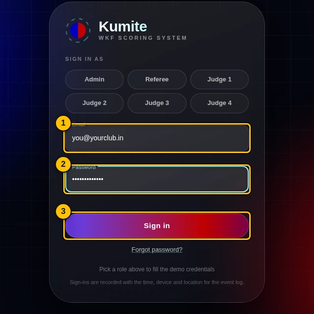

*The sign-in page: 1 Email, 2 Password, 3 Sign in*

- Ignore the buttons above the boxes (Admin, Referee, Judge 1 …). They only fill in the practice accounts of a test server.
- Forgot your password? Click **Forgot password?** under the button. The email you get has a link that works for 30 minutes.
- After more than 10 tries in one minute, the app says "too many attempts". Wait one minute and try again.

### The top bar

The bar across the top is on every page. The numbers match the picture.

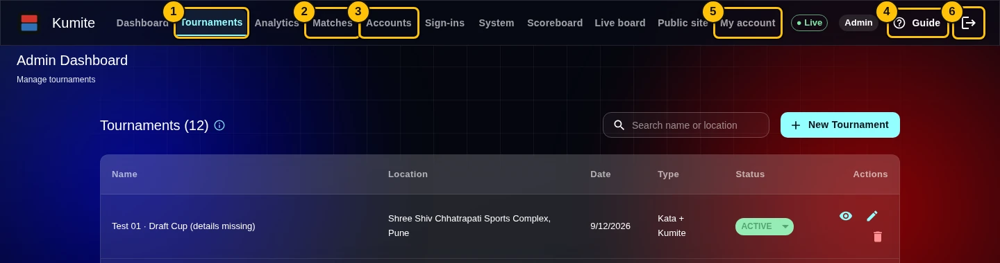

*The top bar: 1 Tournaments, 2 Matches, 3 Accounts, 4 Guide, 5 My account, 6 Sign out*

1. **Tournaments**: the list of tournaments. You start here.
2. **Matches**: the bouts you can score or manage.
3. **Accounts**: the sign-in accounts of your staff. Part 1 shows how to add one.
4. **Guide**: the step-by-step guide built into the app.
5. **My account**: your password, two-step sign-in, and the devices you are signed in on.
6. **Sign out** (the arrow at the far right): use it on a shared computer.

Other staff see fewer items. A referee sees Matches, a judge sees Kata scoring, and an announcer sees Call matches.

### The tournament screen

Click the eye icon next to a tournament to open it. Almost every job in this handbook happens on this screen.

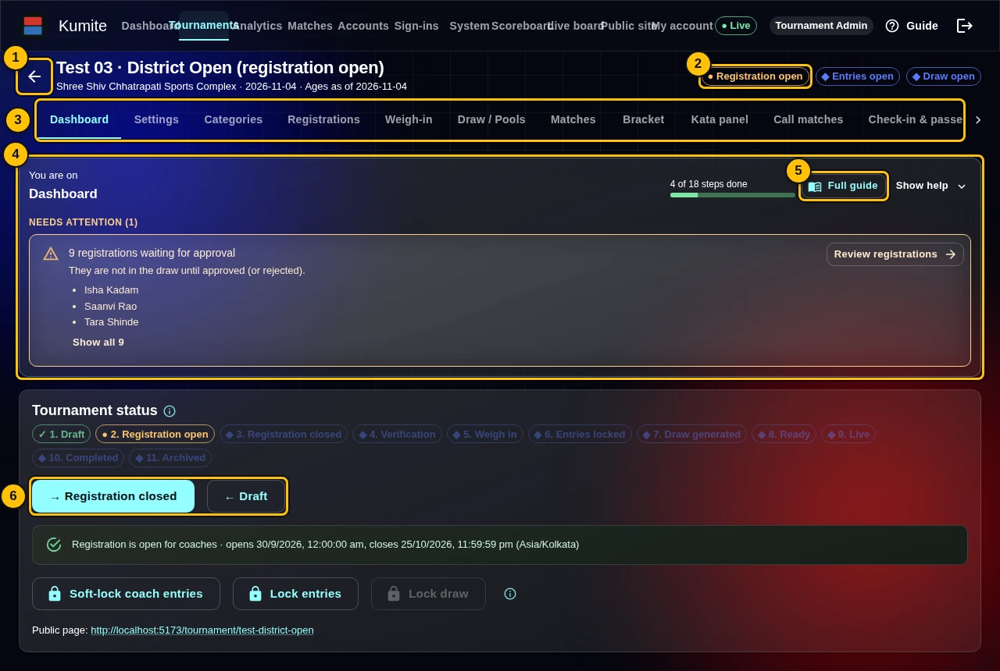

*A tournament's Dashboard: 1 Back, 2 stage, 3 tabs, 4 Needs attention, 5 Full guide, 6 stage buttons*

1. **Back** returns to the list of tournaments.
2. The **stage** the tournament is in (here Registration open) and its locks.
3. The **tabs**, one for each job. Click the arrow at the right end to see the last tabs.
4. **Needs attention** lists what is wrong or still to do, with a button that takes you to the fix. Look here first whenever you are not sure what to do next.
5. **Full guide** shows all 18 small steps, and ticks the ones already done.
6. The **stage buttons**. An arrow to the right (→) moves the tournament to its next stage; an arrow to the left (←) moves it back.

Every button explains itself: rest the mouse on it for a second. A grey button also says why it cannot be used yet.

## 3. The plan

A tournament goes through six parts, always in this order. Each part ends by moving the tournament one stage on, from its Dashboard.

*The plan: 6 parts, when to do them, and the stage after each.*

Parts 1 and 2 take the weeks before the event, Parts 3 and 4 the weigh-in day and the day before, and Parts 5 and 6 the event day and after. The **Guide** button in the app shows the same work as 18 smaller steps, and ticks off each one as it is done.

## 4. Part 1 — Set up the tournament

Set up the tournament a few weeks before the event; it takes about an hour. You create it, fill in its details, build its categories, and make accounts for your staff.

### Job 1: Create the tournament

1. Click **Tournaments** in the top bar, then **New Tournament** (1).

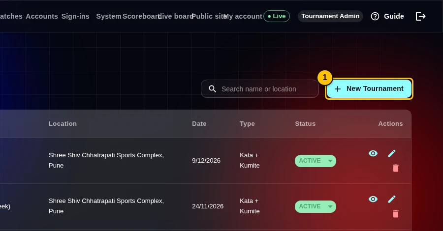

*1 New Tournament*

2. Fill in the four boxes:
   - **Tournament Name** (1), for example "Pune District Open 2026".
   - **Location** (2): the city or the venue.
   - **Tournament Date** (3): click the calendar icon and pick the first day. The box shows the date as month/day/year.
   - **Tournament type** (4): Kata, Kumite, or Kata + Kumite.
3. Click **Create Tournament** (5).

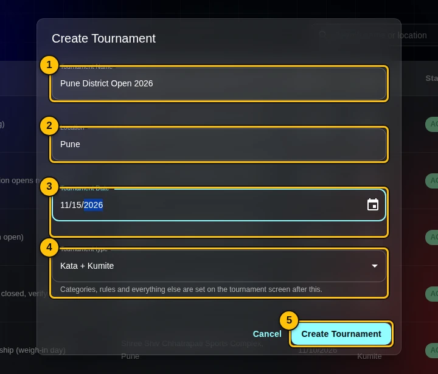

*The create form: 1 name, 2 location, 3 date, 4 type, 5 Create Tournament*

4. In the list, click the eye icon (1) next to the new tournament to open it.

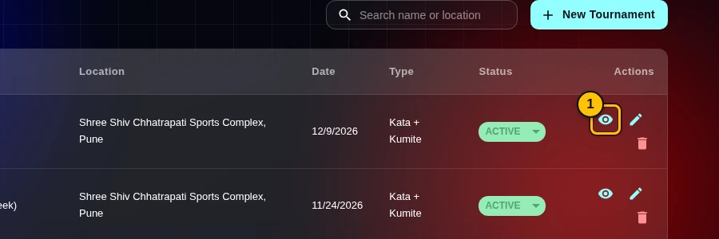

*1 the eye icon opens a tournament*

**Done when** the tournament's Dashboard opens with "Draft" at the top right.

### Job 2: Fill in the details

Coaches cannot register until the details are complete, and Needs attention lists anything still missing.

1. Click the **Settings** tab (1).
2. Under **Tournament details**, fill in:
   - **Master Age Calculation Date** (2): the date every player's age is counted on. Ask the organiser; it is often the first day of the tournament.
   - **Registration opens** (3) and **Registration closes** (4): the date and time between which coaches can register.
   - **Tournament start** and **Tournament end**, **Organizer**, **Contact mobile** and **Contact email**.

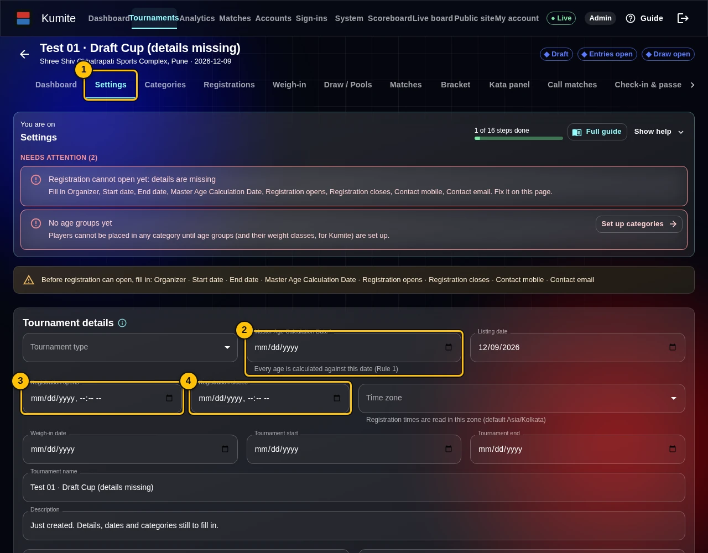

*Settings: 1 the tab, 2 Master Age Calculation Date, 3 and 4 the registration window*

3. Scroll down and click **Save details** (1).

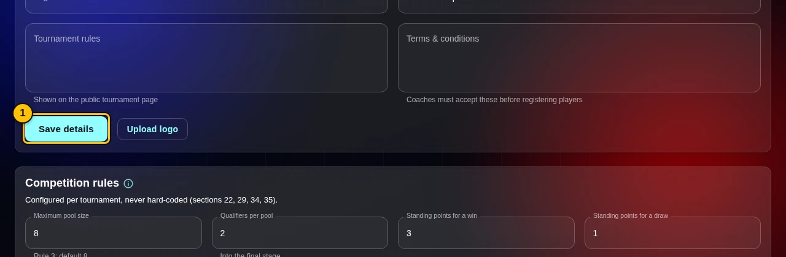

*1 Save details*

4. Leave **Competition rules**, further down, as they are unless the organiser asks for changes. They follow the WKF rules: 3-minute bouts, and a lead of 8 points ends a bout. If you have more than 2 mats, change **Number of mats** and click **Save rules**.

**Done when** Needs attention no longer says "Registration cannot open yet: details are missing".

### Job 3: Build the categories

The app puts every player in a category by itself, so the categories must exist before registration opens.

1. Click the **Categories** tab.
2. The quick way: click **Load standard categories** (1) and choose a ready-made set, such as School Games Federation of India (SGFI), with its age groups and weight classes.
3. Or add each age group yourself: click **Add age group** (2).

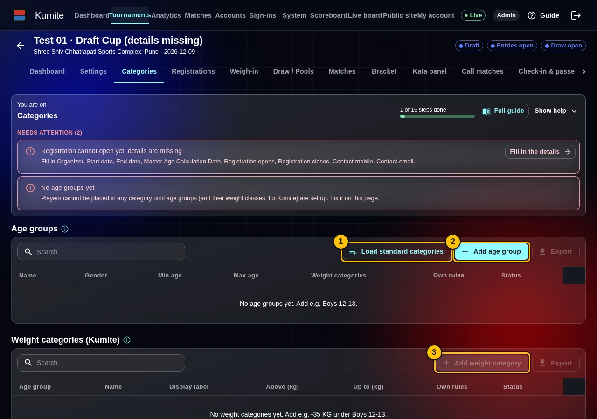

*Categories: 1 Load standard categories, 2 Add age group, 3 Add weight category*

4. In the box that opens, type the **Name** (1), choose the **Gender** (2), type the **Minimum age** (3) and **Maximum age** (4), and click **Save** (5).

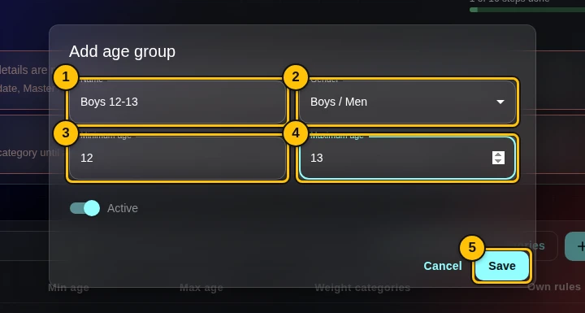

*Add age group: 1 name, 2 gender, 3 and 4 ages, 5 Save*

5. For Kumite, give each age group its weight classes: click **Add weight category** (3 in the picture before), choose the age group, and type the name and limits. "-35 KG" means up to 35 kg, and "+45 KG" means over 45 kg. The button stays grey until an age group exists.
6. Leave no gap between the weight classes. A player whose weight has no class cannot take part, and Needs attention warns you about it.

**Done when** Needs attention no longer says "No age groups yet" or "Some kumite weights have no weight class".

### Job 4: Make accounts for your staff

Each official needs their own account. Make them before the event, so everyone can test their sign-in.

1. Click **Accounts** in the top bar (1), then **New account** (2).

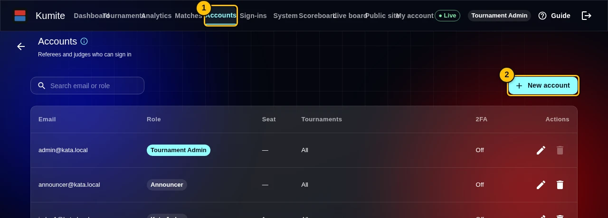

*1 Accounts, 2 New account*

2. Type the person's **Email** (1) and a **Password** (2) of at least 8 characters.
3. Choose the **Role** (3): Referee, Kata Judge, Announcer, Scoreboard Operator, Weigh-in Officer, Registration Officer, Tournament Admin or Viewer (read-only).
4. For a Kata Judge, type their **Seat** (4) on the panel: 1 for the first judge, 2 for the second, and so on.
5. Click **Create account** (5).

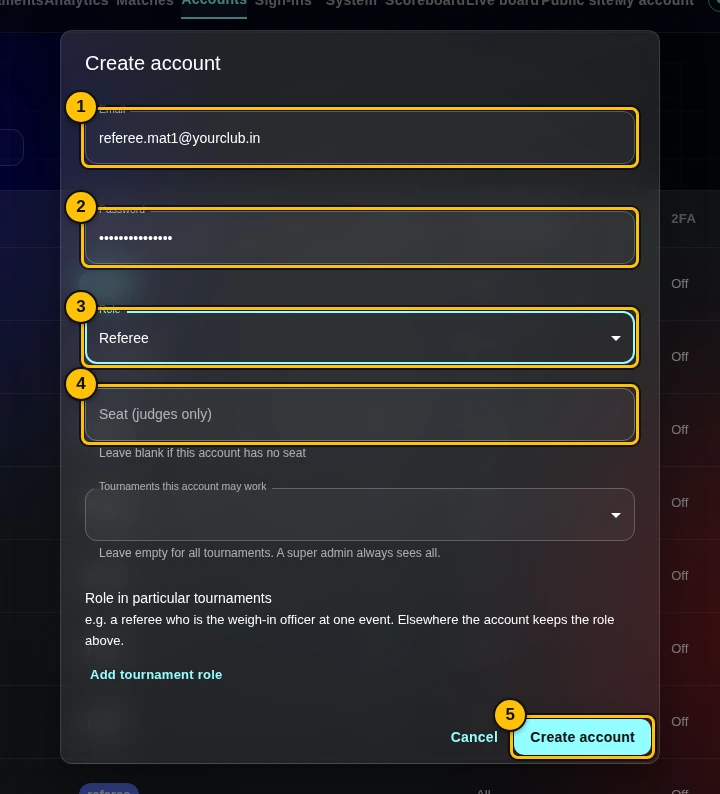

*The new account form: 1 email, 2 password, 3 role, 4 seat, 5 Create account*

6. Give each person their email and password, and ask them to sign in once before the event day.

**Done when** every official is in the Accounts list. You need at least one Referee per mat and one Kata Judge per seat (5 seats unless you changed the panel size).

## 5. Part 2 — Registration

During registration the coaches enter their players. You open it, send the link to the coaches, check each entry, and close it when the time is up.

### Job 5: Open registration

1. Click the **Dashboard** tab.
2. If Needs attention shows a problem, click its button (1) and fix it first. For example, **Fill in the details** opens Settings.
3. Under **Tournament status**, click **→ Registration open** (2).

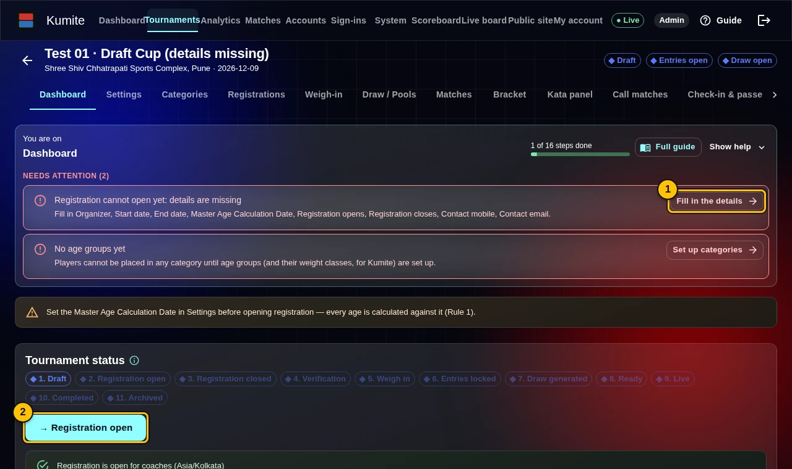

*1 fix what Needs attention lists, 2 Registration open*

**Done when** the stage at the top right says "Registration open".

### Job 6: Send the link to the coaches

1. Click the **Settings** tab and scroll down to **Registration link**. If there is no link yet, click **Generate link**.
2. Click the copy icon (1) at the end of the link.
3. Type a password for the link in **New password** (2) and click **Set password** (3). Coaches need it to open the link.
4. Choose the last day the link works in **Expires on** (4) and click **Save expiry** (5).
5. Keep **Enabled** (6) switched on.

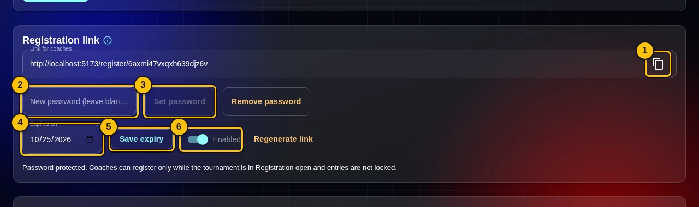

*Registration link: 1 copy, 2 and 3 password, 4 and 5 expiry, 6 Enabled*

6. Send the link and its password to the coaches, for example on WhatsApp or by email.

A coach who opens the link types its password (1) and clicks **Continue** (2). They then register their team, add their players one by one, and can watch whether each player is approved.

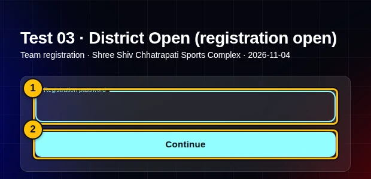

*What a coach sees first: 1 the link password, 2 Continue*

- Coaches can register only between the opening and closing times you set in Job 2.
- If the link reaches people it should not, click **Regenerate link**. The old link stops working; send the new one to the coaches.

### Job 7: Check and approve the entries

Every entry waits for your approval, and only approved players go into the draw. Check the new entries every day while registration is open.

1. Click the **Registrations** tab. Needs attention says how many players are waiting.
2. Find a player marked **Pending verification** (1).
3. Check their name, date of birth, club and weight, then use the icons at the end of the row (2):
   - ✓ **Approve**: the entry is correct.
   - ✕ **Reject**: the player cannot take part. Type the reason; the coach sees it.
   - ↶ **Request correction**: the coach must fix something. Type what is wrong; the entry goes back to the coach.
4. When every waiting entry is correct, you can click **Approve all pending** (3) instead.

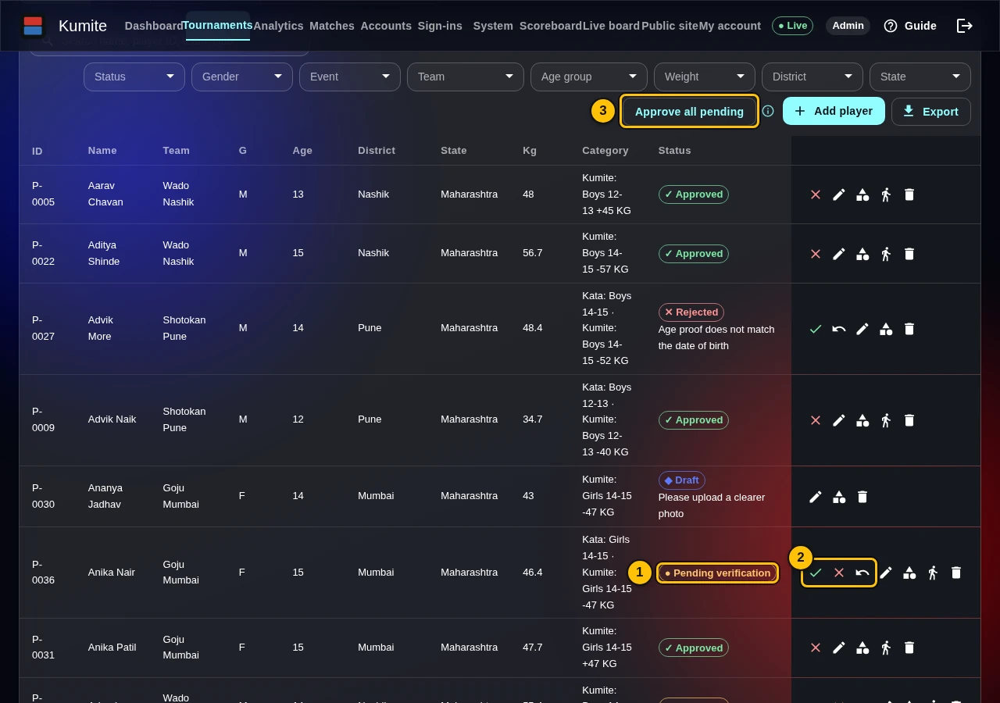

*Registrations: 1 a waiting player, 2 approve, reject or send back, 3 Approve all pending*

- The other icons on a row are: the pencil to edit, the shapes to change the category, the walking figure to withdraw a player (injury or no-show), and the bin to delete.
- To enter a player yourself, for example a late entry by phone, click **Add player**.
- **Possible duplicates**, a list on the same tab, shows players who may have been entered twice. Check it before you close registration.

**Done when** Needs attention no longer lists registrations waiting for approval.

### Job 8: Close registration

1. After the closing date, click the **Dashboard** tab.
2. Click **→ Registration closed** (1).

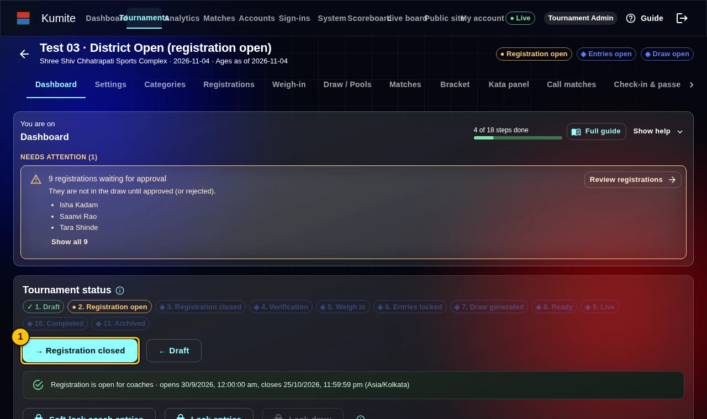

*1 Registration closed*

Coaches can no longer add players, though the app already stopped them at the closing time. You can still correct entries until you lock them in Part 3.

## 6. Part 3 — Weigh-in, lock and draw

After registration closes, you weigh the Kumite players, freeze the list of players, and let the app draw the pools and make the bouts. Do these jobs in this order; the app allows them only in this order.

### Job 9: Weigh in the Kumite players

Kata players are not weighed.

1. Optional: on the Dashboard, click **→ Weigh in**, so the stage shows that weigh-in has started.
2. Click the **Weigh-in** tab. Needs attention lists the players not weighed yet.
3. On the player's row, type the weight in **kg** (1), choose the **Result** (2) (Passed, Failed or Recheck), and click **Save** (3).
4. When every player is weighed, click **Close weigh-in** (4).

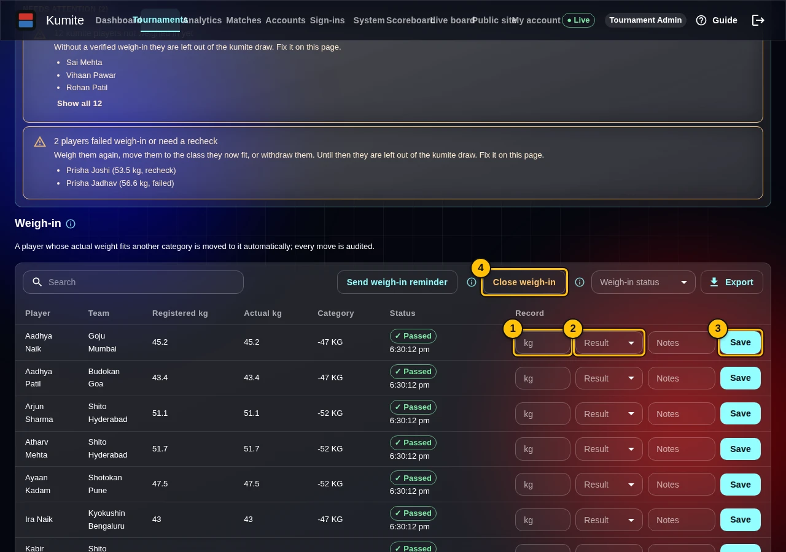

*Weigh-in: 1 weight, 2 result, 3 Save, 4 Close weigh-in*

What the app does with the weight:

- If the weight fits a different weight class, the app moves the player to that class by itself.
- If no weight class covers the weight, Passed is refused. Add the missing class on the Categories tab, then save the weight again.
- A player marked Failed or Recheck stays out of the draw until weighed again, moved to another class or withdrawn.

**Done when** Needs attention no longer lists players not weighed in, or failed weigh-ins.

### Job 10: Place every player in a category

1. Click the **Draw / Pools** tab.
2. Click **Run categorisation** (1). The app places every approved player by gender, age, event and weight.

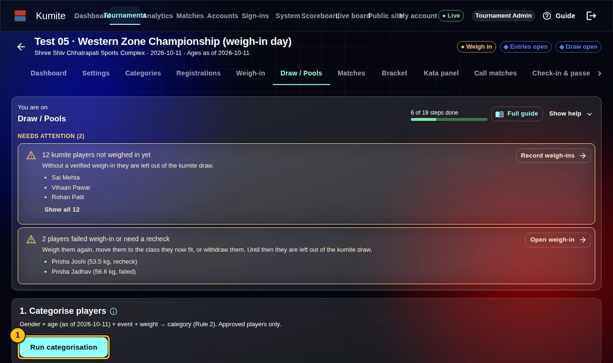

*1 Run categorisation*

Do this before Job 11: the button turns grey once the entries are locked.

**Done when** Needs attention lists no players without a category. If it lists some, add the missing age group or weight class, or change their category on the Registrations tab, then run it again.

### Job 11: Lock the entries

Locking freezes the list of players: nobody can add, change or weigh a player any more.

1. Click the **Dashboard** tab.
2. Click **→ Entries locked** (1).

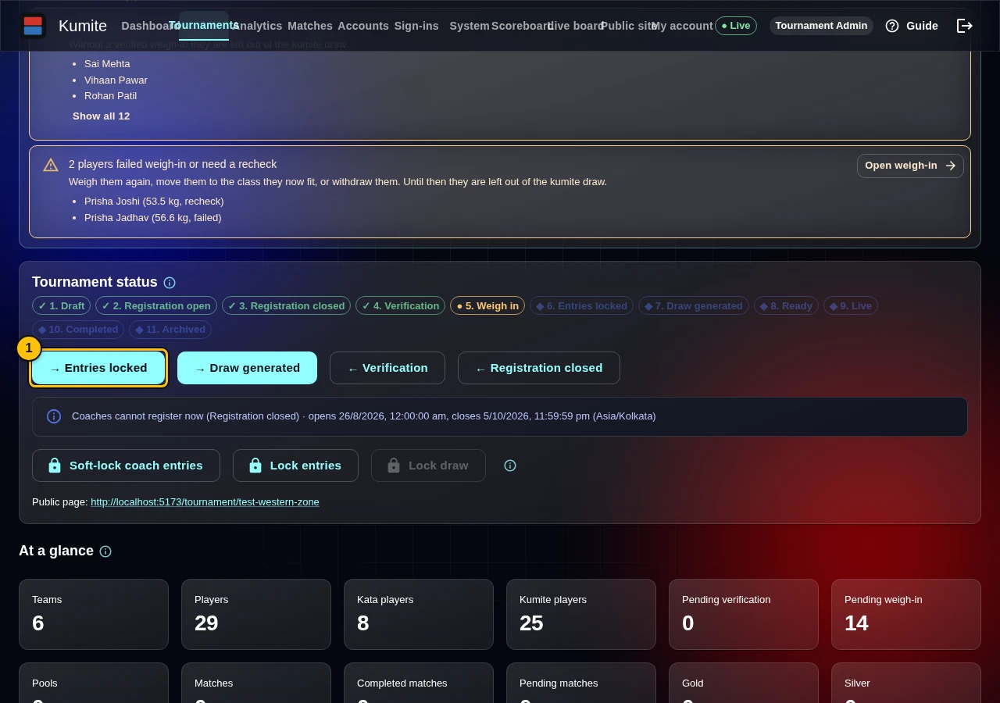

*1 Entries locked*

To undo it, click **Unlock entries** and type a reason. This works only until the draw is locked (Job 13).

### Job 12: Draw the pools

1. Click the **Draw / Pools** tab.
2. Click **Draw all categories** (1). In the box that opens, keep the settings and click **Generate pools**.

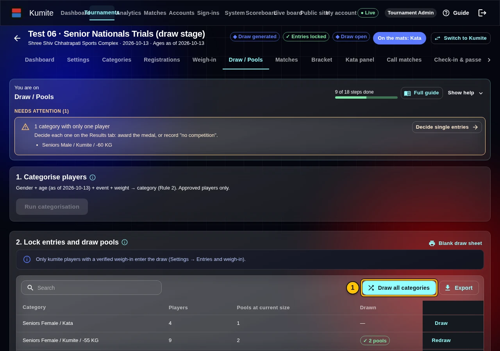

*1 Draw all categories*

- The app shares out each category's players into pools at random, at most 8 to a pool. Everyone in a pool fights everyone else in it once.
- The stage moves to Draw generated by itself.
- A category with only one player cannot have bouts. Needs attention lists it, and you award that player on the Results tab (Part 6).
- To draw one category again, click **Redraw** on its row. This is possible only before any of its bouts has a result.

### Job 13: Lock the draw

1. Click the **Dashboard** tab.
2. Click **Lock draw** (1).

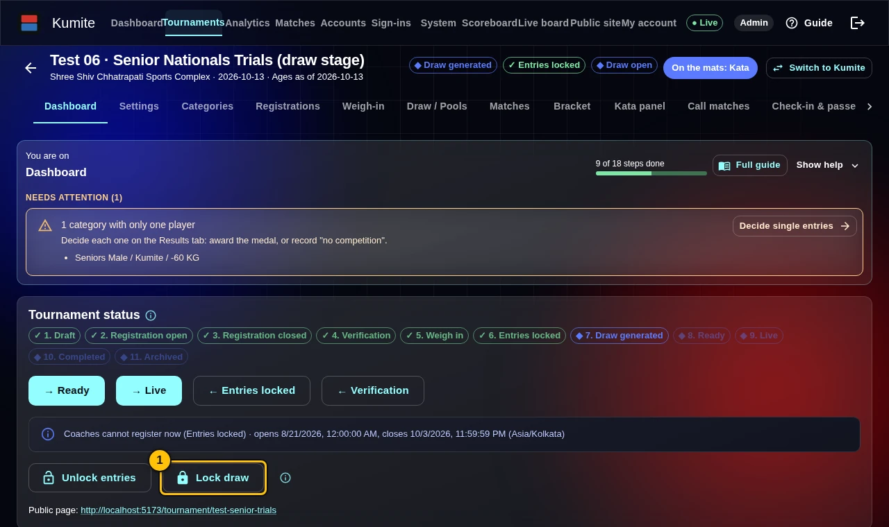

*1 Lock draw*

The pools can no longer change.

### Job 14: Make the bouts

1. Click the **Draw / Pools** tab and scroll to the bottom.
2. Click **Generate matches** (1), then confirm.

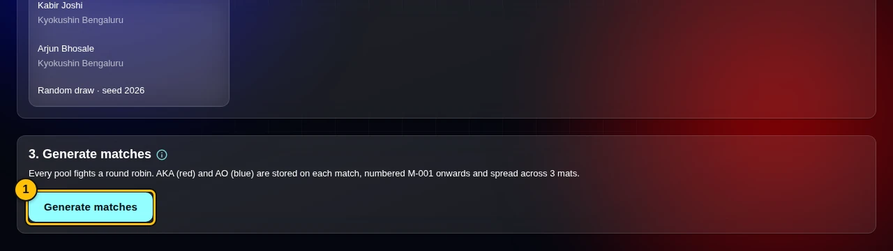

*1 Generate matches*

The app makes every bout of every pool, numbers them M-001, M-002 and so on, and shares the categories out over your mats.

**Done when** the bouts are listed on the Matches tab.

## 7. Part 4 — Prepare the day

The day before the event, give the bouts their times and officials, print the passes if you use them, and plan which device goes where.

### Job 15: Give each bout a time and officials

The app has already put each category on a mat. You add the start times and the officials.

1. Click the **Matches** tab. **Queue** lists the bouts not started yet.
2. On a bout's row, click the **Schedule** icon (1). The icon beside it (2) opens the scoring console, which you will use on the day.

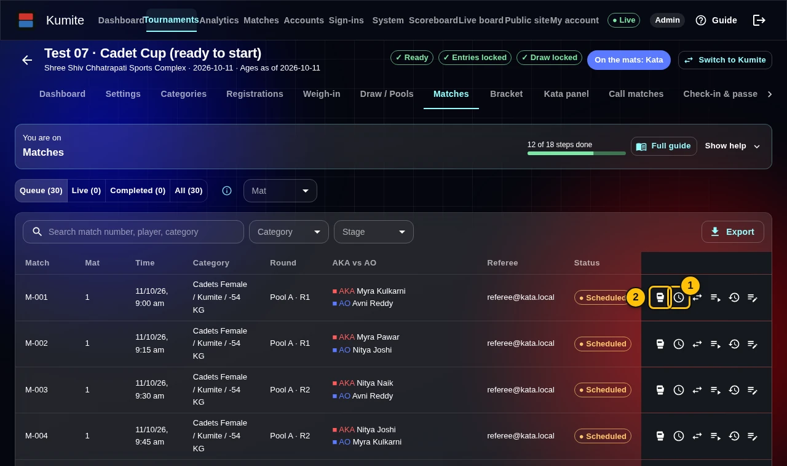

*Matches: 1 Schedule, 2 Open scoring console*

3. Check the **Mat** (1), choose the **Referee** (2) and the **Judges** (3), and set the start **Time** (4).
4. Click **Save** (5).

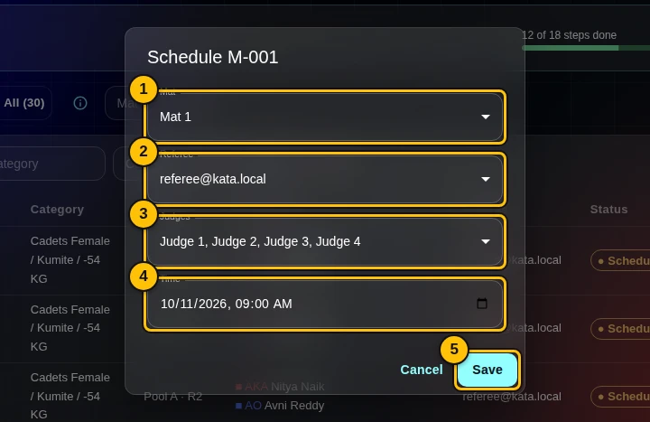

*Schedule: 1 mat, 2 referee, 3 judges, 4 time, 5 Save*

- The app refuses a time that puts a mat, an official or a player in two bouts at once, and says who clashes. Pick another time or mat.
- The time is read from your computer's clock, so make sure it shows the venue's time.
- Each referee's tablet lists the bouts given to them, by mat and time.

### Job 16: Print passes (optional)

A pass is an ID card with a photo, a role and a QR code, checked at the door and at the mat.

1. Click the **Check-in & passes** tab.
2. Tick who gets a pass (1): Athletes, Team managers & coaches, Judges & referees.
3. Click **Generate passes** (2), then **Download PDF** (3), and print the file. Each A4 page holds eight passes.

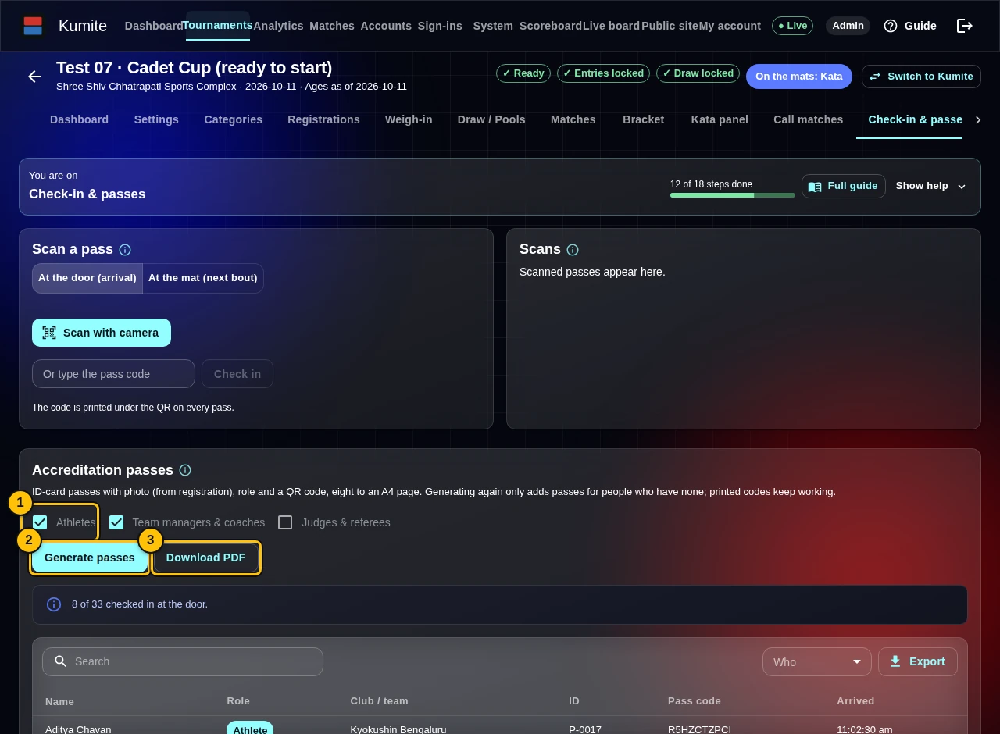

*Passes: 1 who gets one, 2 Generate passes, 3 Download PDF*

### Job 17: Plan the devices in the hall

On the morning, each device opens the app's address and signs in with the account of the person using it.

| Device | Where | Signs in as | Opens |
| --- | --- | --- | --- |
| Your laptop | Your desk | Tournament Admin | The tournament's Dashboard |
| A tablet or laptop at each mat | The mat table | Referee | **Matches**, then the bout (Part 5) |
| A phone or tablet for each kata judge | The judges' chairs | Kata Judge | **Kata scoring** |
| A laptop or tablet | The announcer's table | Announcer | **Call matches** |
| A TV beside each mat | Facing the spectators | No sign-in | The mat's screen address (below) |

The TV screens need no sign-in. Each one opens the app's address followed by **/display?mat=1** for mat 1 (for example karate.yourclub.in/display?mat=1), **?mat=2** for mat 2, and so on.

The Scoreboard Operator's page lists these screens, so they open with one click:

1. **Mat 1** (1), **Mat 2** and so on: one mat's bout and score, for the TV beside that mat.
2. **Live board (every mat)** (2): every mat and the next bouts, for a big screen in the hall or spectators' phones.
3. To put a message on the screens, type it in **Message for the hall** (3) and click **Show** (4), for example "Lunch break until 1:30 pm". **Clear** removes it.

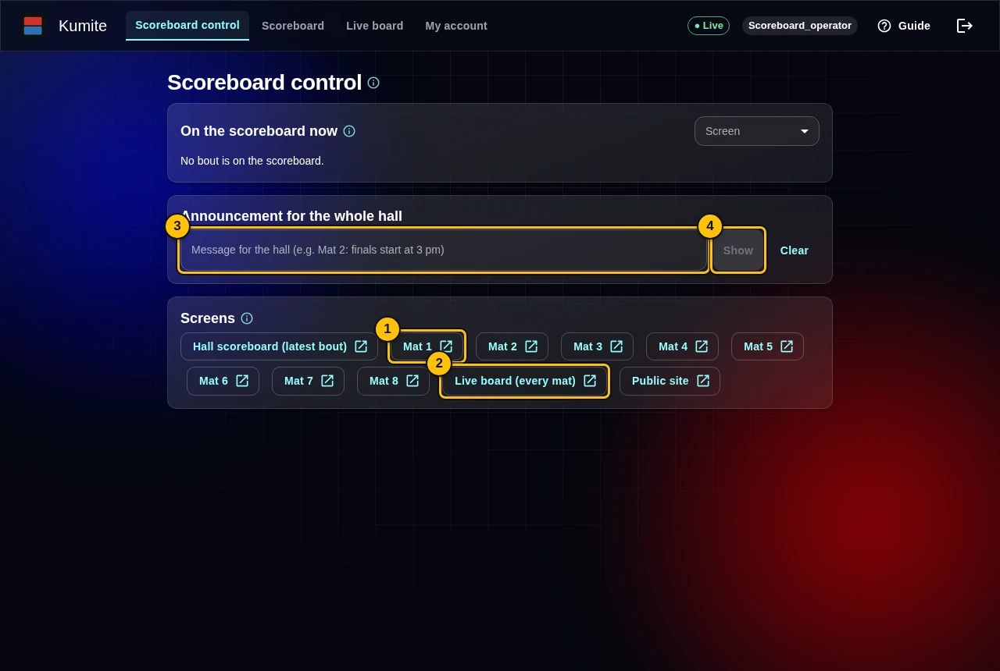

*Scoreboard control: 1 a mat's screen, 2 Live board, 3 and 4 a message for the hall*

## 8. Part 5 — Competition day

On the day, the tournament goes Live and runs one event at a time: all the Kata, then all the Kumite, or the other way round. The announcer calls each bout, the referee scores it on the console, and the screens follow every point.

### Job 18: Start the day

1. Optional, at the door: on **Check-in & passes**, choose **At the door (arrival)** (1) and click **Scan with camera** (2), then hold each pass up to the camera. Or type the code printed under the QR (3) and click **Check in** (4).

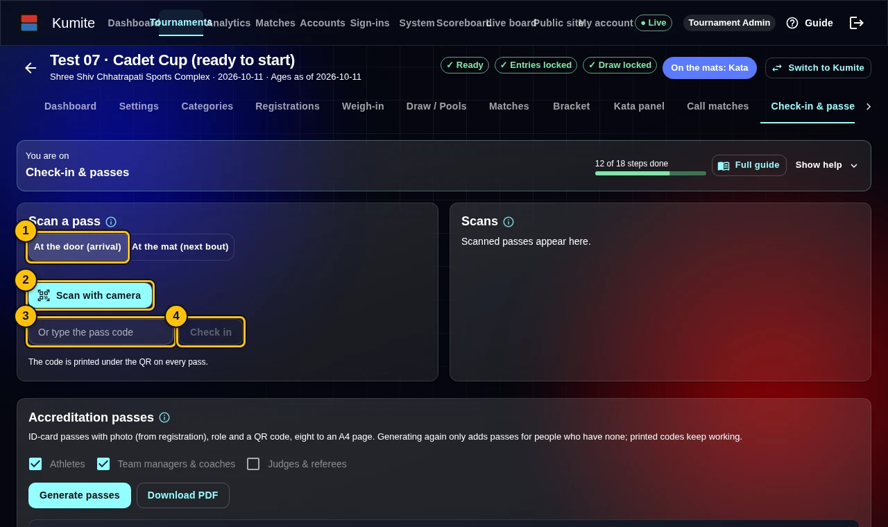

*Check-in: 1 at the door, 2 scan with the camera, 3 and 4 type the code*

2. On the **Dashboard**, click **→ Live** (1).
3. The blue chip at the top says which event is on the mats, for example "On the mats: Kata". When that event is finished, click **Switch to Kumite** (2) (or **Switch to Kata**).

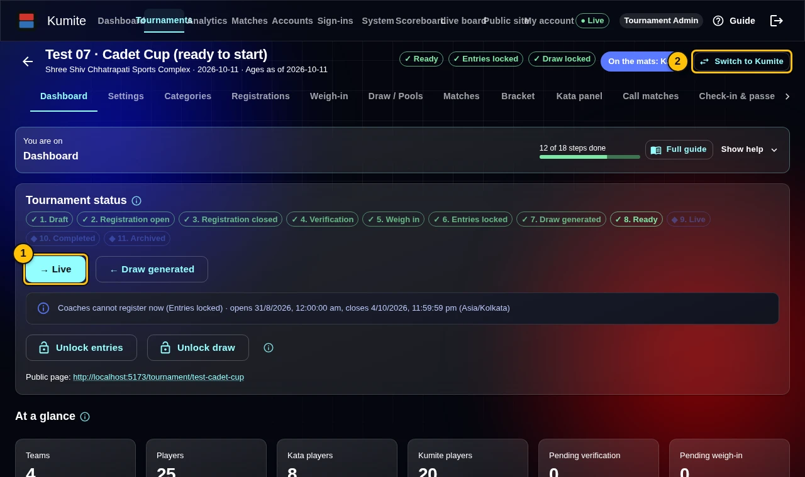

*1 Live, 2 switch to the other event*

The app does not switch while a bout is called or running, or a kata round is open. Finish those first.

### Job 19: Call the bouts

This is the announcer's job.

1. Open the **Call matches** tab. Each mat has its own column: the bout on the mat now, then the next ones.
2. Click **Call** on the next bout, and announce it. **Call again** (1) repeats the call and shows how long ago the first one was.
3. As each player arrives, click **Present** (2), or **Absent** if they do not come. When both are present, the bout is Ready.

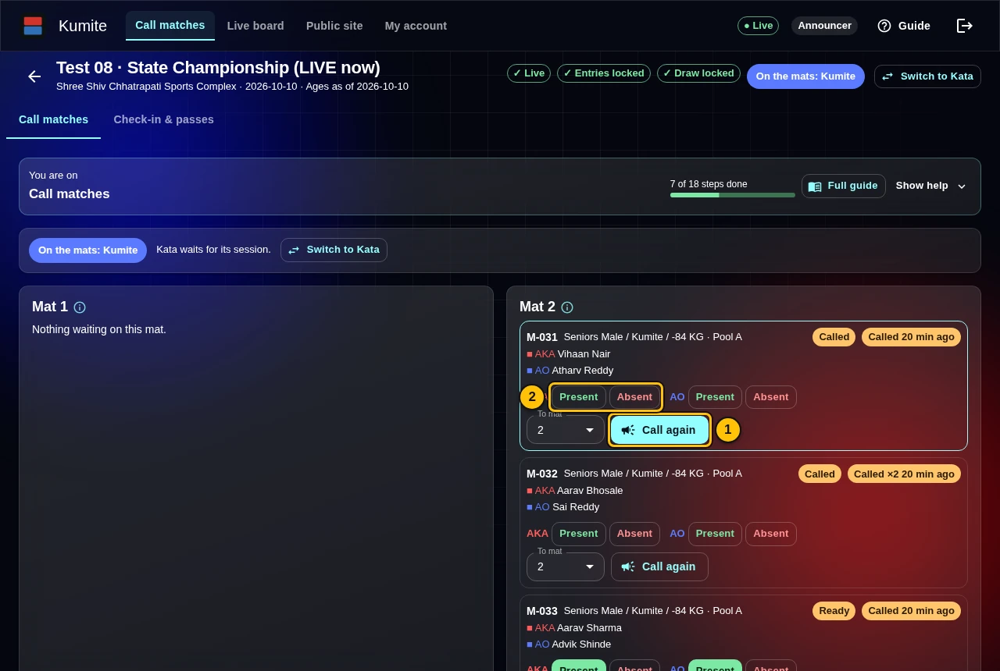

*Call matches: 1 Call again, 2 Present or Absent*

If one mat runs ahead of another, choose a different mat in **To mat** to move a bout there.

### Job 20: Score a Kumite bout

The referee, or a helper at the mat table, runs each bout on the console. Ao (blue) is on the left and Aka (red) on the right.

1. Open the bout: on the mat's tablet, click **Matches**, then the bout. On your laptop, the console icon on the Matches tab opens it too.
2. Check the **Mat** box (5). It starts on the mat the bout is scheduled on, and that mat's TV shows this bout.
3. Click **Start scoreboard** (6) to put the bout on the hall screens.
4. Click **Start** (1) when the referee starts the bout. Click it again to stop the clock.
5. When the referee gives a score, click it on that player's side (2): **Yuko (+1)**, **Waza-ari (+2)** or **Ippon (+3)**. The first score also gives that player **Senshu**.
6. For a penalty, tick the box on that player's side (3): C, then K, HC and H. Category 1 and Category 2 are counted separately.
7. Clicked the wrong button? Click **Undo** (4) to take back the last action.
8. When the bout is over, click **Close** (8) and confirm the winner. The result reaches the draw and the screens at once.

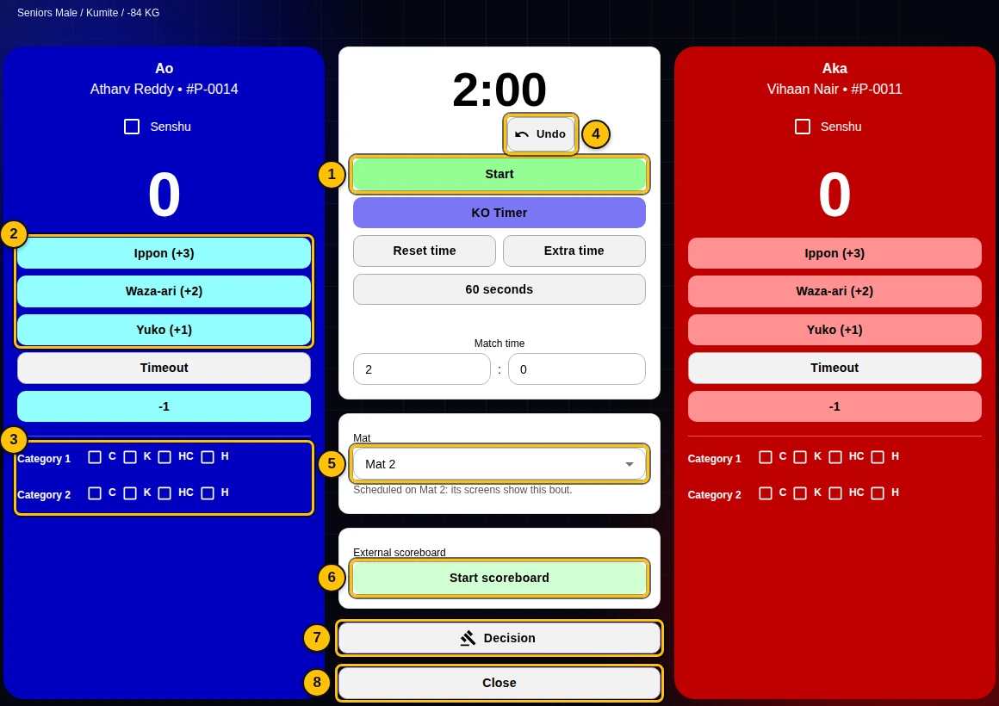

*The scoring console: 1 Start, 2 points, 3 penalties, 4 Undo, 5 Mat, 6 Start scoreboard, 7 Decision, 8 Close*

How a bout ends:

- A lead of 8 points ends the bout at once.
- At time up, the higher score wins. In a tie, the player with Senshu wins.
- A player whose penalties reach H loses the bout.
- For a withdrawal, a disqualification or a referees' decision, click **Decision** (7) and choose Kiken, Shikkaku or Hantei.

The console protects the bout:

- While the clock runs, buttons that could spoil the bout (such as Reset time, Close or a change of mat) ask you to confirm. Points and Stop never ask.
- If the internet drops, keep scoring. The tablet sends every action, in order, when the connection returns.
- Only one device runs a mat at a time. Any other device shows the console read-only, with **Take over** in case the first device fails.

### Job 21: Run a Kata round

A panel of judges scores kata, each judge on their own phone or tablet. You open the round, the judges score it, and you complete it.

1. Click the **Kata panel** tab. Each kata category has its own box.
2. Click **Open round 1** (1) on a category, then **Confirm**. The app draws the order the players perform in.

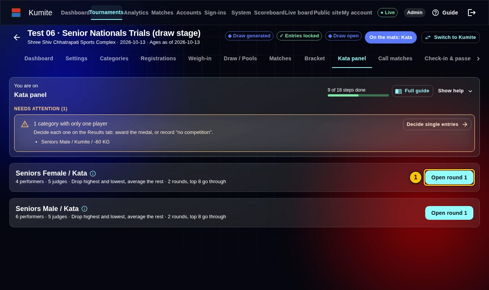

*1 Open round 1*

3. Check that every seat has a judge (1). If a judge is missing, choose another for that seat and click **Save judges** (2).
4. Click **Start round** (3) and confirm. The judges can now score.

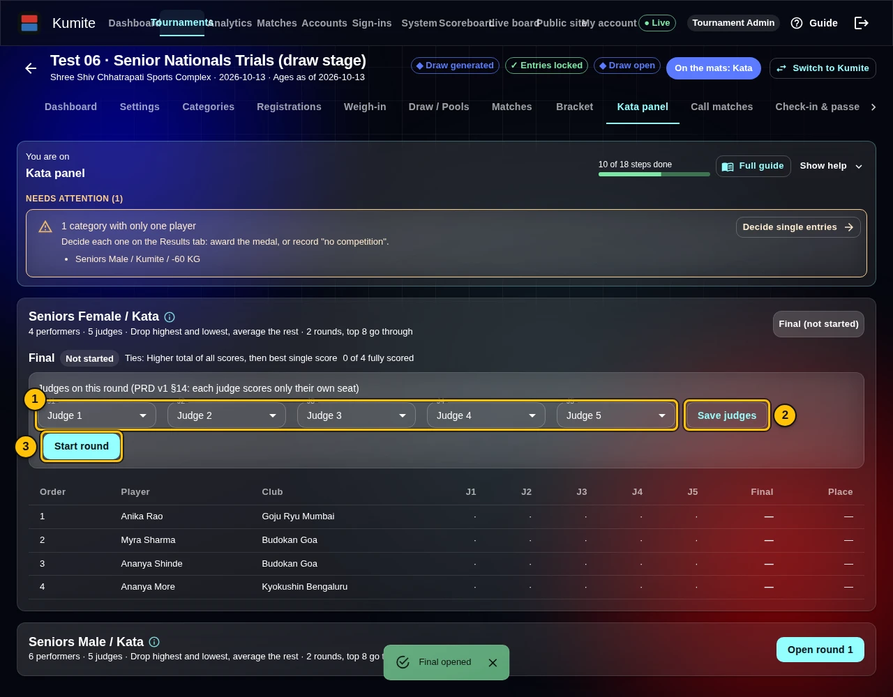

*Before the round: 1 a judge in each seat, 2 Save judges, 3 Start round*

5. On their own device, each judge clicks **Kata scoring**, then the round (1).

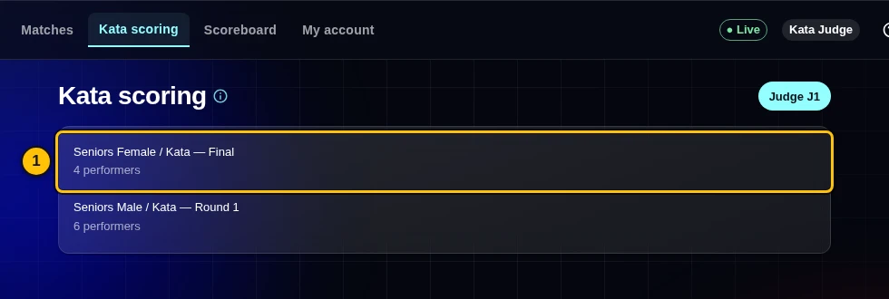

*A judge's list of open rounds: 1 the round to score*

6. After each player performs, the judge types the score (1), for example 8.5, and clicks **Submit** (2). A score cannot be changed once it is sent.

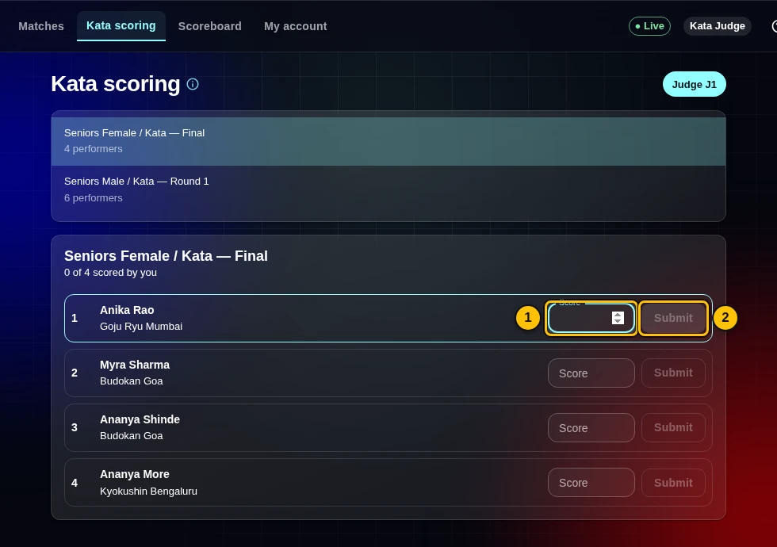

*A judge scores: 1 the score, 2 Submit*

7. On the Kata panel, the scores fill in as they arrive. When every judge has scored every player, click **Complete round**. The best 8 go through to the next round, until the final.

Scores run from 5.0 to 10.0, with one decimal. The app drops each player's highest and lowest score and averages the rest.

### What the hall screens show

Each mat's TV shows the two players and their clubs, the score, Senshu, the clock and the next bout. It changes by itself with every point.

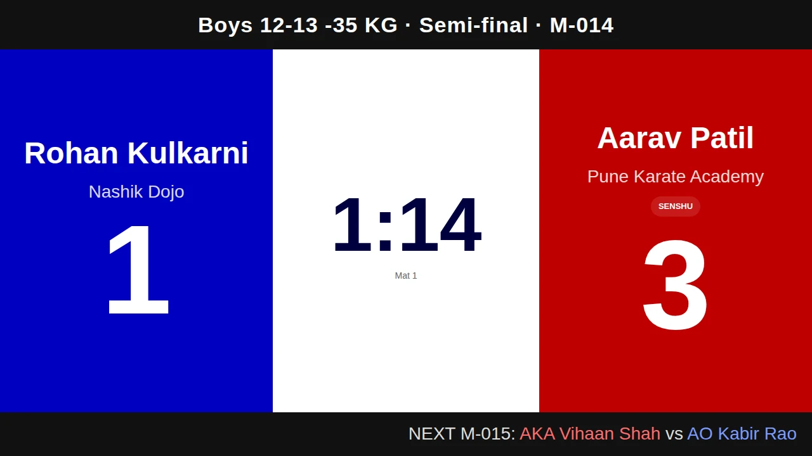

*A mat's TV during a bout*

If a screen shows **NOT LIVE**, the mat's tablet has sent nothing for 5 seconds. Check that tablet's internet.

## 9. Part 6 — Results and finishing

The app works out each category's standings and medals as its bouts finish. You start the knockout stage, check and publish the results, print the certificates and download the reports, then close the tournament.

### Job 22: Start the knockout stage

Do this on competition day, as soon as all the pool bouts of a category are finished.

1. Click the **Results** tab and find the category.
2. Click **Generate final stage**. The best players of each pool (2 by default) go into a knockout draw, and its bouts appear on the Matches tab as soon as both players of a bout are known.

### Job 23: Check and publish the results

1. On the **Results** tab, each category shows its stage: In progress, Provisional (every bout decided), Verified, Published or Locked.
2. Check a category's standings and medals, then click **Verify result** (1).
3. When you are ready to show the results to everyone, click **Publish results** (2). They appear on the public page, and the teams are told.

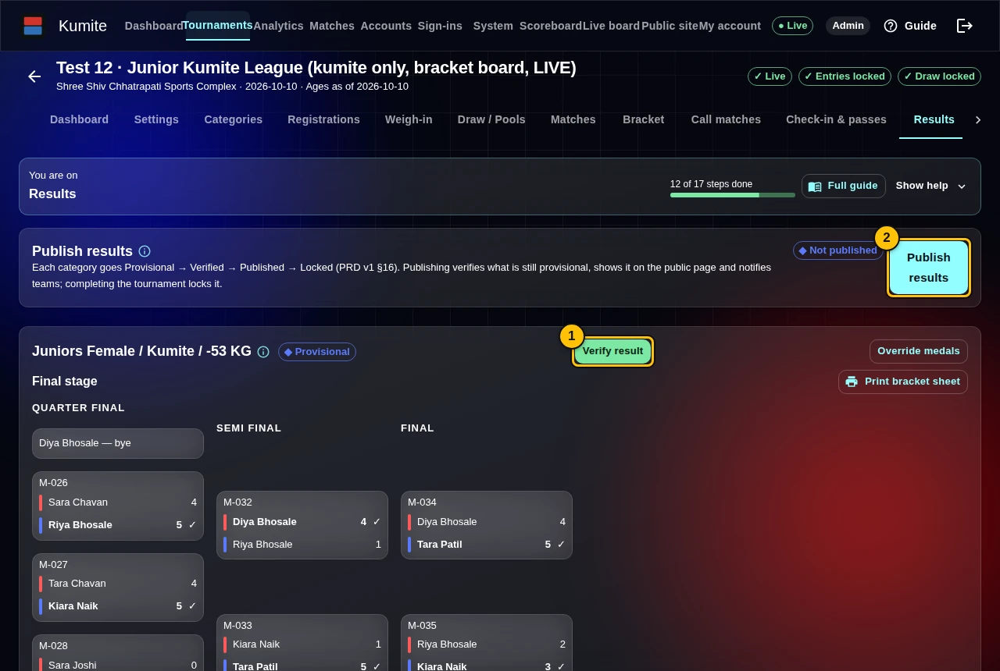

*Results: 1 Verify result, 2 Publish results*

- A category with only one player: click **Decide single entries**, then award the gold or record "no competition".
- A medal is wrong: click **Override medals** and type the reason.
- **Unpublish** takes results off the public page, and **Re-publish** puts them back.

### Job 24: Print the certificates

1. Click the **Certificates** tab.
2. Tick who gets one (1): Medal winners, Participation (every player who took part), Team managers and coaches, Judges and referees.
3. Click **Generate** (2).
4. Click **Download PDF** (3) to save them, or **Print / save as PDF** (4) to print them.

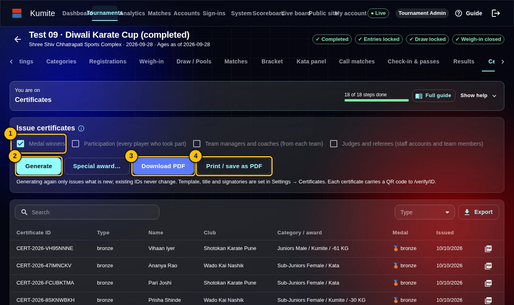

*Certificates: 1 who gets one, 2 Generate, 3 Download PDF, 4 Print*

Each certificate has its own number and a QR code, so anyone can check it is genuine. Generating again adds only the new certificates; those already issued keep their numbers.

### Job 25: Download the reports

1. Click the **Reports** tab. To include only some players, choose the filters at the top first.
2. On a report, click **Excel** (1), **CSV** (2) or **PDF** (3).

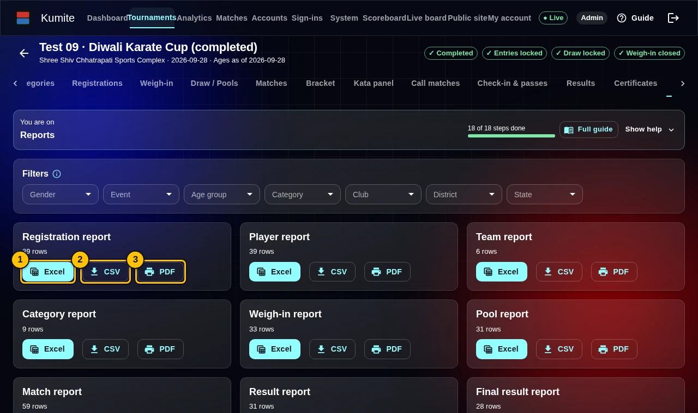

*Reports: 1 Excel, 2 CSV, 3 PDF*

The reports cover registrations, players, teams, categories, weigh-in, pools, matches, results, medals, the medal tally and attendance.

### Job 26: Finish the tournament

1. When every result is published, click the **Dashboard** tab.
2. Click **→ Completed** (1). Every published result is locked.

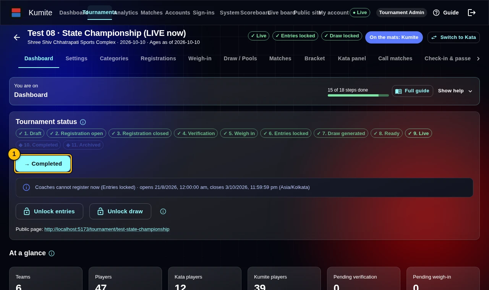

*1 Completed*

3. Later, click **→ Archived** to keep the tournament as read-only history.

To correct a result after Completed, a Tournament Admin moves the tournament back to Live and types the reason. An archived tournament cannot be reopened.

## 10. Checklists to print

Tick each line as you go. The job numbers point to the steps in Parts 1 to 6.

### A few weeks before

- [ ] Tournament created and its details saved (Jobs 1 and 2)
- [ ] Categories built, with no missing age groups or weight classes in Needs attention (Job 3)
- [ ] An account for every official, and each one has signed in once (Job 4)
- [ ] Registration opened, and the link and its password sent to the coaches (Jobs 5 and 6)

### While registration is open

- [ ] New entries approved, rejected or sent back each day (Job 7)
- [ ] Possible duplicates checked (Job 7)

### The week before

- [ ] Registration closed (Job 8)
- [ ] Number of mats in Settings matches the real mats (Job 2)
- [ ] Venue Wi-Fi tested on a tablet and on a TV
- [ ] A tablet for each mat, a phone or tablet for each kata judge, and the TVs ready

### Weigh-in day, or the day before

- [ ] Every Kumite player weighed, and weigh-in closed (Job 9)
- [ ] Categorisation run, entries locked, pools drawn, draw locked and bouts made (Jobs 10 to 14)
- [ ] Every bout has a time, a referee and judges (Job 15)
- [ ] Passes printed, if you use them (Job 16)

### The morning of the event

- [ ] Every device signed in with the right account (Job 17)
- [ ] Each TV shows its own mat's screen (Job 17)
- [ ] Tournament moved to Live, with the first event on the mats (Job 18)

### During the day

- [ ] Needs attention on the Dashboard checked every hour
- [ ] Knockout stage started as each category's pools finish (Job 22)
- [ ] Event switched when the first one is finished (Job 18)

### After the event

- [ ] Every result verified and published (Job 23)
- [ ] Certificates printed (Job 24)
- [ ] Reports downloaded (Job 25)
- [ ] Tournament moved to Completed (Job 26)

## 11. When something goes wrong

First look at **Needs attention** at the top of the tab: it names the problem and has a button to the fix. When the app refuses something, its message says why. These are the problems you are most likely to meet.

| Problem | What to do |
| --- | --- |
| "Wrong email or password" | Check both. Click **Forgot password?** if needed |
| "Too many attempts" | Wait one minute, then try again |
| A button is grey | Rest the mouse on it to see why. Usually an earlier job is not done yet |
| "Fill in the required tournament details first" | On Settings, fill in every field that Needs attention lists, then click **Save details** |
| A coach says the link does not work | Check that the stage is Registration open, that today is inside the registration dates, and that the link is Enabled and not expired. Send the current link |
| A coach says "Wrong password" | Send them the link password again, or set a new one (Job 6) |
| A player has no category | Add the missing age group or weight class, or change the player's category on Registrations. Then click **Run categorisation** again |
| "No weight class covers this weight" at weigh-in | Add the weight class on Categories, then save the weight again |
| A player was entered twice | Open **Possible duplicates** on Registrations, and delete or withdraw the extra entry |
| "Entries are locked" when you change a player | On the Dashboard, click **Unlock entries** and type a reason. Not possible once the draw is locked |
| "Time clash" when you schedule a bout | Choose another time or mat. The message says who clashes |
| "That event is not on the mats now" | Finish the current event, then click **Switch to Kata** or **Switch to Kumite** at the top |
| A wrong score on the console | Click **Undo** straight away. After the bout is closed, a Tournament Admin uses **Correct result** on the Matches tab and types the reason |
| The mat's tablet lost the internet during a bout | Keep scoring. The tablet sends everything when it is back online |
| "Another device is running this mat" | If that device has failed or left, click **Take over** |
| A hall screen shows NOT LIVE | The mat's tablet is offline. Fix its Wi-Fi; the screen recovers by itself |
| A judge sees "No kata round you are judging is open" | Start the round on the Kata panel (Job 21) and check that the judge has a seat |
| A player does not come to the mat | The announcer marks them **Absent**. The referee records the result with **Decision**, or you use **Enter result** and choose No-show |
| A player is injured and cannot go on | On Registrations, click the walking figure to withdraw them. Their remaining bouts go to their opponents |
| "You do not have permission to do that" | Your role cannot do it. Ask a Tournament Admin |
| "This session was signed out" | Your sign-in ended or was stopped from another device. Sign in again |

For any other message, the full [User Guide](../user-guide/README.md) lists every message and what to do.

## 12. Words you will see

Section 1 explained event, category, pool, bout, mat, Aka and Ao. These are the other words on the screens.

| Word | What it means |
| --- | --- |
| Yuko, Waza-ari, Ippon | Scores worth 1, 2 and 3 points |
| Senshu | The first score of a bout, made while the opponent has none. It wins a bout that is tied at time up |
| C, K, HC, H | The penalty steps: chukoku (a warning), keikoku, hansoku-chui and hansoku. H loses the bout |
| Category 1, Category 2 | The two kinds of penalty, counted separately |
| Hansoku | Losing a bout because of penalties |
| Kiken | A player withdraws from the bout; the opponent wins |
| Shikkaku | A disqualification; the opponent wins |
| Hantei | The referees' decision on a tied bout |
| Golden score | Extra time in which the first score wins |
| Walkover, No-show | A bout won because the opponent withdrew or did not come |
| Round robin | Everyone in a pool fights everyone else once |
| Final stage | The knockout bouts after the pools |
| Bracket | A knockout draw: the winner of each bout goes on to the next round |
| Bye | An empty place in round 1; the player goes straight to round 2 |
| Seed | A top player kept apart from the other top players in the draw |
| Panel, Seat | The kata judges scoring a round, and each judge's place on it (J1, J2 …) |
| Master Age Calculation Date | The date every player's age is counted on |
| Stage | Where the tournament is: Draft, Registration open, Registration closed, Weigh-in, Entries locked, Draw generated, Ready, Live, Completed, Archived |
| Session | The event on the mats now, Kata or Kumite |
| Lock | Freezes something so it cannot change: the entries, the draw or the results |
| Provisional, Verified, Published | A result worked out by the app, checked by you, and shown to the public |
| Pass | An ID card with a photo and a QR code, scanned at the door or the mat |
| Needs attention | The box at the top of each tab that lists what to fix next |
