# Karate Tournament App — User Guide

_Last updated 9 October 2026._

New to the app? Start with the [operator handbook](../operator-handbook/README.md), which walks through every job click by click.

A tournament runs in eight steps: set it up, build its categories, take registrations, weigh in, draw, schedule the bouts, run the competition day, and publish the results. This guide shows each screen, who uses it, and every rule the app checks along the way.

## Contents

1. [Getting in](#1-getting-in)
2. [The workflow at a glance](#2-the-workflow-at-a-glance)
3. [Step 1 — Create the tournament](#3-step-1--create-the-tournament)
4. [Step 2 — Categories](#4-step-2--categories)
5. [Step 3 — Registration](#5-step-3--registration)
6. [Step 4 — Weigh-in (Kumite)](#6-step-4--weigh-in-kumite)
7. [Step 5 — Lock entries and draw](#7-step-5--lock-entries-and-draw)
8. [Step 6 — Matches: mat, time and officials](#8-step-6--matches-mat-time-and-officials)
9. [Step 7 — Competition day](#9-step-7--competition-day)
10. [Step 8 — Results, certificates and reports](#10-step-8--results-certificates-and-reports)
11. [Administration](#11-administration)
12. [Validation rules](#12-validation-rules)
13. [Messages and what to do](#13-messages-and-what-to-do)
14. [Karate terms on screen](#14-karate-terms-on-screen)

## 1. Getting in

Everyone uses the same web address. Staff sign in with an email and password, coaches use the tournament's registration link, and the public pages need no sign-in.

### Web addresses

In the table, `<app>` is the address where your app is installed (for example `https://karate.yourclub.in`). On the test server it is `http://localhost:5173`.

| Page | Address | Who uses it | Sign-in |
| --- | --- | --- | --- |
| Sign in | `<app>/login` | All staff | — |
| Admin home | `<app>/admin` | Admins | Yes |
| Your account (password, two-step sign-in, devices) | `<app>/account` | Anyone signed in | Yes |
| Forgot password | `<app>/forgot-password` | Staff | No |
| Coach registration | `<app>/register/<link code>` | Coaches and team managers | Link password |
| Public tournament list | `<app>/tournaments` | Anyone | No |
| Public tournament page | `<app>/tournament/<short name>` | Anyone | No |
| Live board (every mat, next bouts, brackets) | `<app>/live?t=<short name>` | Hall TV, spectators | No |
| Hall scoreboard | `<app>/display` (latest bout) or `<app>/display?mat=2` (one mat) | Hall TVs | No |
| Certificate check (the QR code on a certificate) | `<app>/verify/<certificate ID>` | Anyone | No |
| Pass check (the QR code on a pass) | `<app>/checkin/<code>` | Door staff | No |

### Signing in

1. Open `<app>/login`.
2. Enter the email and password your administrator gave you.
3. If two-step sign-in is on for your account, enter the 6-digit code from your authenticator app.
4. The app opens the home screen for your role (table below).

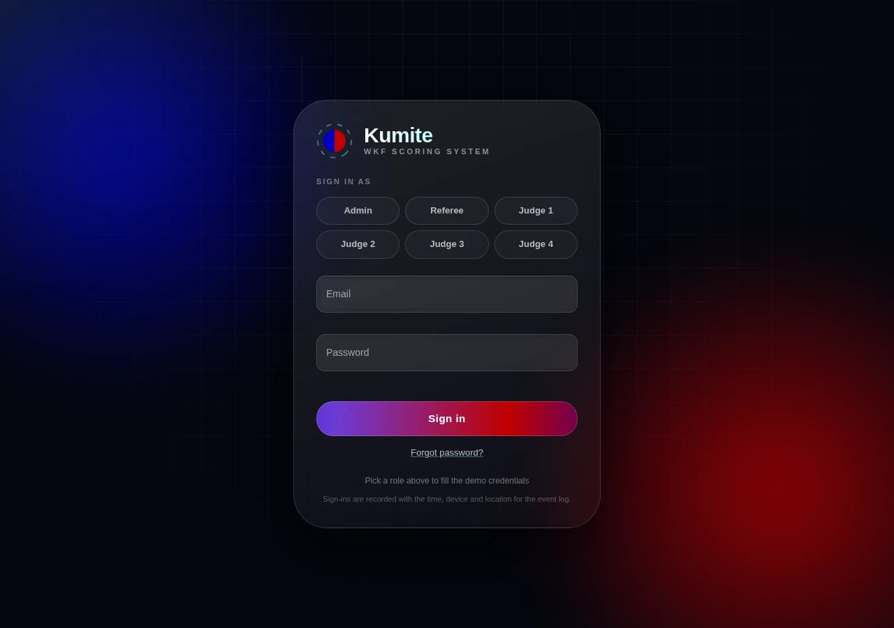

*The sign-in page. The role buttons only fill in the demo accounts of the test server.*

- A sign-in lasts 12 hours, one tournament day. After that, sign in again.
- More than 10 sign-in attempts for one account in a minute, or 60 from one address, are refused with "too many attempts". Wait a minute and try again.
- **Forgot password** sends a reset link that works for 30 minutes. At most 5 requests per 15 minutes.
- Test server only: every demo account uses the password `test123`. Change or delete these accounts on a real server.

### Roles and what each one sees

An account has one role. An admin can also give it a different role inside one tournament, or limit it to some tournaments (Accounts page).

| Role | Home screen | Tournament tabs and screens |
| --- | --- | --- |
| Super Admin | `/admin` | Everything, plus backups, rulesets and organisations |
| Tournament Admin | `/admin` | Every tournament tab, accounts, sign-ins, analytics |
| Registration Officer | Choose a tournament | Dashboard, Registrations |
| Weigh-in Officer | Choose a tournament | Dashboard, Registrations (read), Weigh-in, Check-in & passes |
| Announcer | Choose a tournament | Call matches, Check-in & passes |
| Referee | Assigned matches | The scoring console for their bouts |
| Kata Judge | Matches and Kata scoring | Scores their seat on a kata panel |
| Scoreboard Operator | Scoreboard control | Hall screens and announcements only |
| Viewer (read-only) | Choose a tournament | Dashboard, Registrations, Reports |
| Coach / Team Manager | The registration link | Their own team and players only |

Only admins hold the sensitive privileges: correcting a finished score, overriding a result, redrawing pools, reopening a completed tournament, and overriding a closed weigh-in.

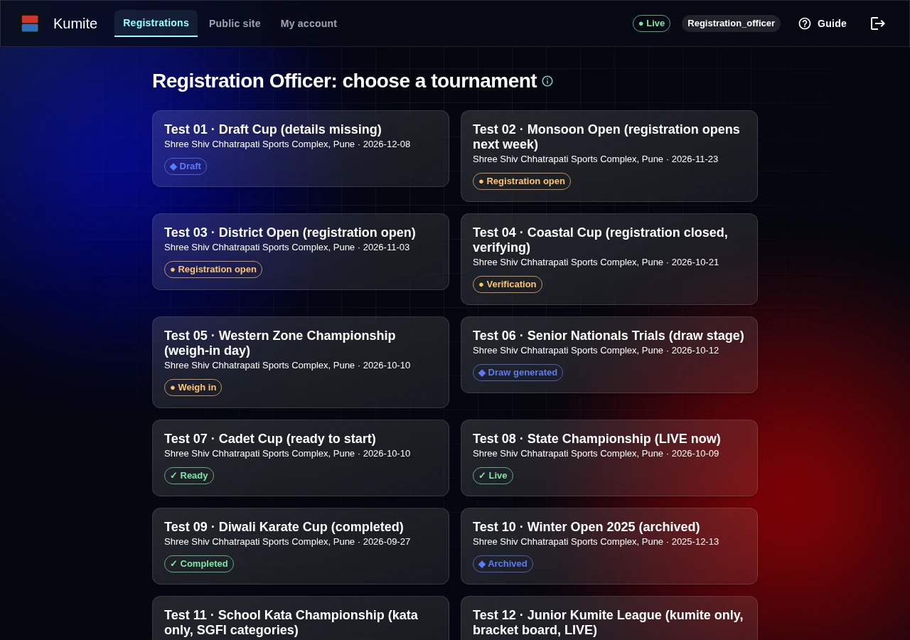

*Staff with one job pick a tournament first (here the Registration Officer).*

### Help inside the app

- **Guide** (top right) opens the whole workflow, step by step, with your progress for the open tournament.
- **Needs attention** at the top of every tournament tab lists what is wrong or still to do, with a button that takes you there.
- Every button explains itself when you hover over it, including why a greyed-out button cannot be pressed yet.
- The ⓘ icons explain each section.

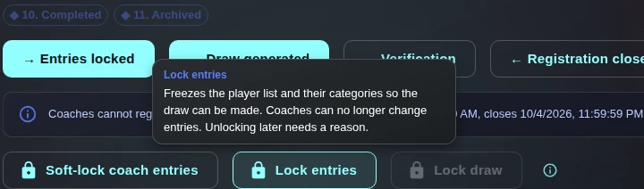

*Hovering over a button says what it does.*

## 2. The workflow at a glance

The tournament moves through its stages in order, and each step ends by moving it one stage on from its Dashboard.

*The workflow: 8 steps and the tournament stage after each.*

In practice steps 3 and 4 overlap: entries are checked while they come in, and weigh-in follows the close of registration. The in-app **Guide** splits these eight steps into 18 smaller ones and ticks each off as it is done.

| Stage | What it allows |
| --- | --- |
| Draft | Setting up: details, rules, categories. Coaches cannot register |
| Registration open | Coaches register through the link, inside the registration window |
| Registration closed, Verification | The office checks and approves entries; coaches cannot add players |
| Weigh-in | Weights are recorded |
| Entries locked | The player list and categories are frozen; pools can be drawn |
| Draw generated | Pools are drawn; the draw can be locked and the matches generated |
| Ready | Optional: everything is set for the day |
| Live | The competition runs; entries stay locked |
| Completed | Every published result is locked |
| Archived | Read-only history |

## 3. Step 1 — Create the tournament

An admin creates the tournament with four fields, then completes its Settings tab. Registration cannot open until every required detail is filled in.

### Create it

1. Go to **Tournaments** and press **New Tournament** (or **New tournament** on the Dashboard).
2. Enter the Tournament Name, Location, Tournament Date and Tournament type: Kata, Kumite, or Kata + Kumite.
3. Press **Create Tournament**, then open the tournament with the eye icon.

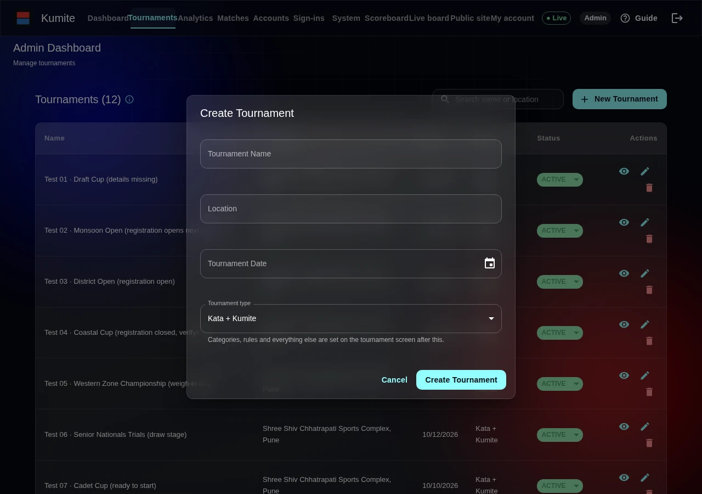

*The create form asks for four things; everything else is set on the tournament screen.*

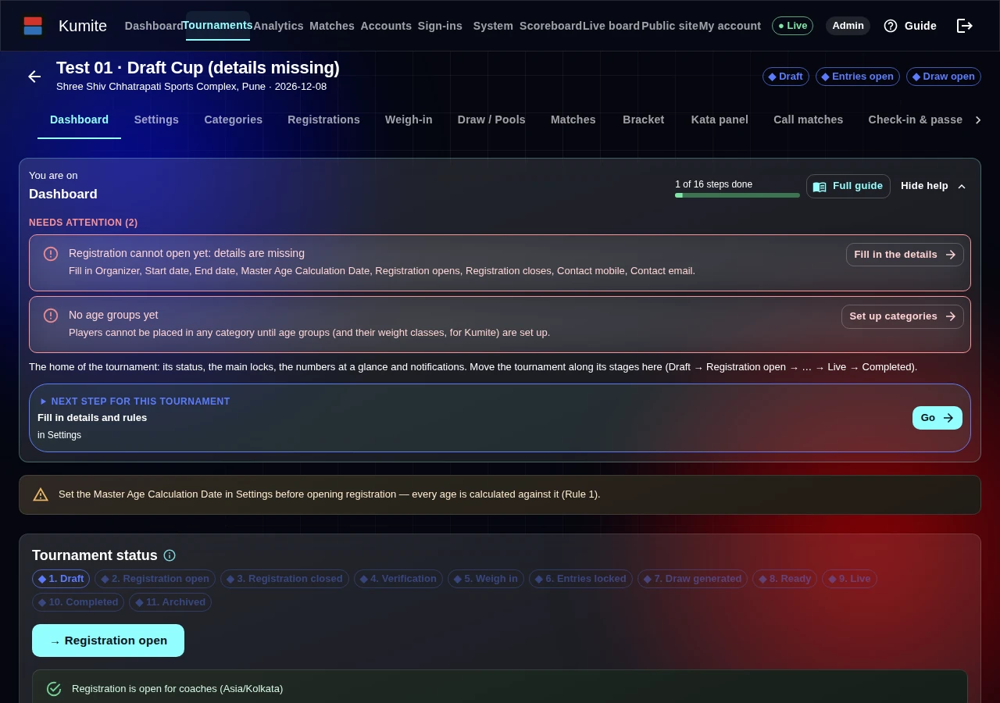

*A new tournament's Dashboard: Needs attention says what is missing and links to the fix.*

### Fill in the Settings tab

Settings has four parts. Each part has its own Save button.

| Part | What you set there |
| --- | --- |
| Tournament details | Type; Master Age Calculation Date (every age is counted on this date); listing date; registration opens and closes (date and time); time zone (default Asia/Kolkata); weigh-in date; start and end dates; name, description, organizer, association; venue, location, address, city, district, state, country; contact person, mobile and email; logo; public address (short name); rules and terms shown to coaches |
| Competition rules | Ruleset; point values (Yuko 1, Waza-ari 2, Ippon 3); how pools are split; round robin or straight knockout; which event goes first; how kata is decided (judging panel or flag bouts); kata judges, qualifiers and rounds; pool size, qualifiers per pool, standing points, bronze medals, number of mats, match duration, winning point gap; the advanced options (draw, tie at time, penalties, kata score range, weigh-in, results, certificates, notifications) |
| Registration link | The coach link and its password (Step 3) |
| Registration form | The player fields coaches fill in (Step 3) |

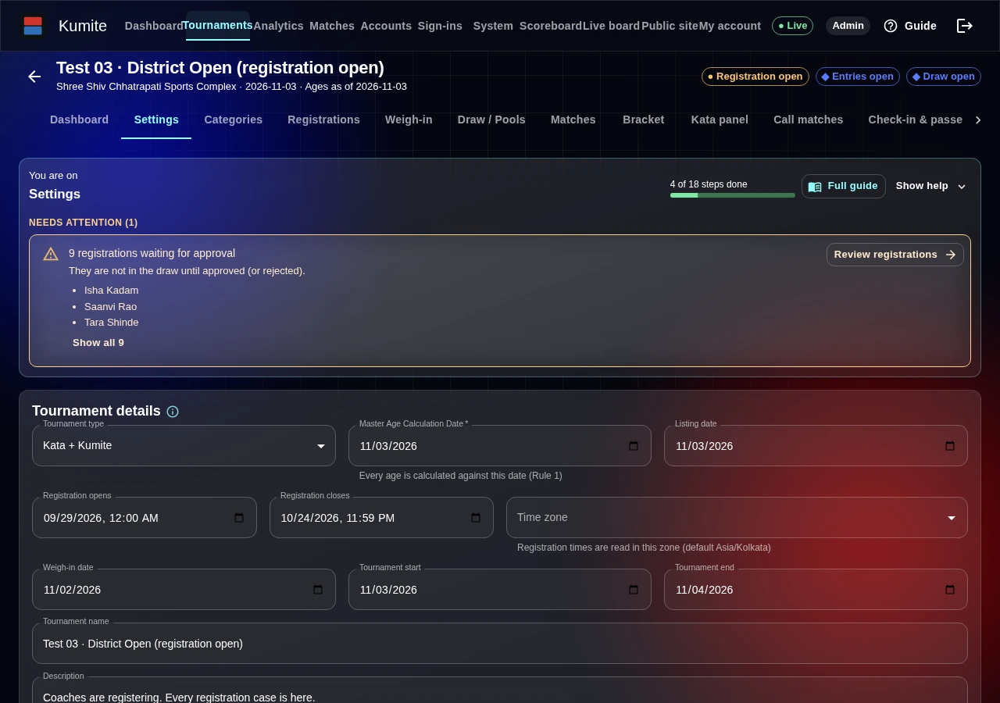

*Settings, Tournament details. The Needs attention box still shows open work from other tabs.*

### Default competition rules

These apply until you change them. A category can override several of them for itself (Step 2).

| Rule | Default | Allowed |
| --- | --- | --- |
| Number of mats | 2 | 1 to 20 |
| Match duration | 180 seconds | 30 to 600 seconds |
| Winning point gap (bout ends) | 8 points | 1 to 20 |
| Point values | Yuko 1, Waza-ari 2, Ippon 3 | 1 to 10 each |
| Tie at time | Senshu decides | Senshu, extra time, golden score, referees' decision, or a draw |
| Extra time | 60 seconds | 10 to 300 seconds |
| Penalty categories | 2 (each C, K, HC, H) | 1 or 2 |
| Maximum pool size | 8 | 2 to 64 |
| Pool split when uneven | Even pools (17 → 6 + 6 + 5) | Even pools, or fewest pools (17 → 9 + 8) |
| Competition system | Round robin in pools, then knockout | Or straight knockout |
| Qualifiers per pool | 2 | 1 to 8 |
| Standing points | Win 3, draw 1 | 0 to 10 each |
| Bronze medals per category | 2 | 0, 1 or 2 |
| Third-place match | Off | On or off |
| Byes in a bracket | Allowed | Allowed or not |
| Event on the mats first | Kata | Kata or Kumite |
| How kata is decided | Judging panel | Panel, or head-to-head flag bouts |
| Kata judges on a panel | 5 | 3 to 7 |
| Kata score | 5.0 to 10.0, one decimal | Range and decimals can change |
| Kata calculation | Drop highest and lowest, average the rest | Or plain average, sum, or sum without highest and lowest |
| Kata rounds / qualifiers per round | 2 / 8 | 1 to 5 / 1 to 64 |
| Only verified weigh-ins enter the draw | On | On or off |
| Weight decimal places | 1 | 0 to 3 |
| Upper weight limit is inclusive | On (35.0 kg fits "-35 kg") | On or off |
| Results go public | When the admin publishes | Or automatically when verified |
| Public page | Public | Public, unlisted (link only) or private |

## 4. Step 2 — Categories

A player's category comes from age group and gender, and for Kumite also from the weight class. Set categories up before registration opens, because the app sorts every player into them automatically.

### Age groups

1. Open the **Categories** tab.
2. Press **Add age group**. Enter a name (for example "Boys 12-13"), the gender (Boys/Men, Girls/Women or Mixed), and the youngest and oldest age.
3. Or press **Load standard categories** to add a full set at once. The SGFI set adds U-14, U-17 and U-19 for boys and girls, with the SGFI weight classes.
4. Optional: **Own rules** lets one age group use different rules (pool size, pool split, round robin or knockout, match duration, point gap, qualifiers, ruleset, kata panel settings).

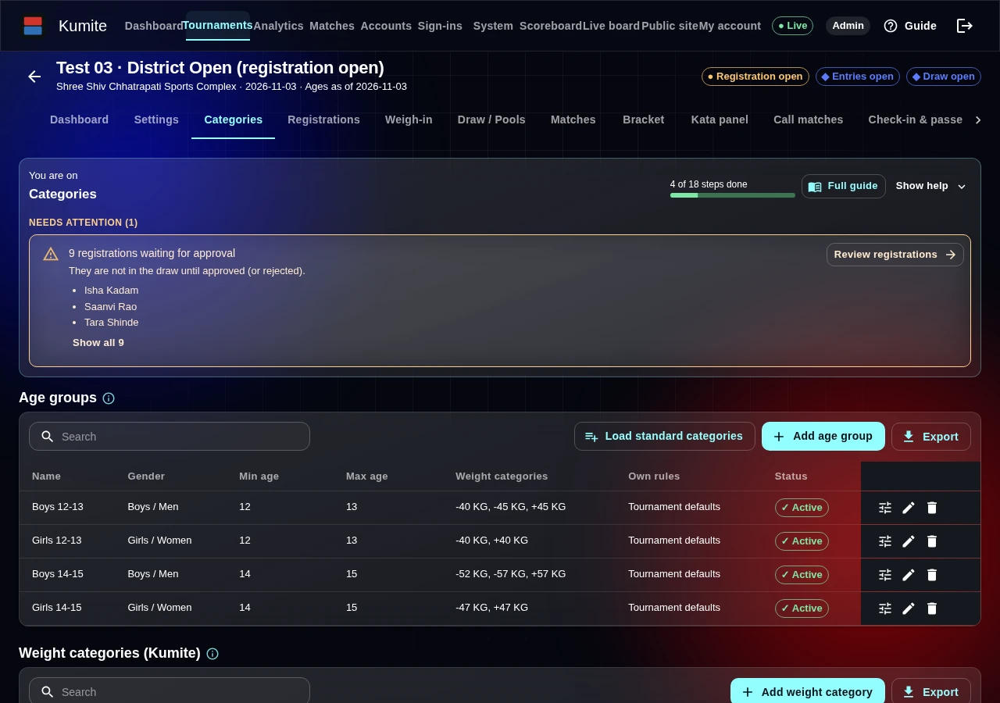

*Categories for a Kata + Kumite tournament: age groups, then weight classes.*

### Weight classes (Kumite only)

1. Under **Weight categories (Kumite)**, press **Add weight category**.
2. Choose the age group and give a name and limits. "-35 KG" means up to 35 kg; "+45 KG" means above 45 kg.
3. Cover every weight. If the classes stop or leave a gap ("-40 KG" then "+45 KG" leaves 40 to 45 kg), Needs attention warns that some weights have no class. A player at such a weight gets no category and is left out of the draw.

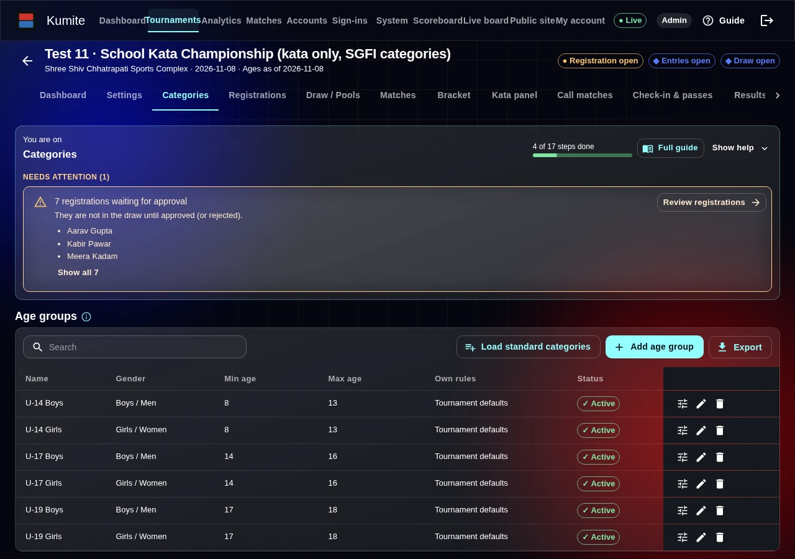

*A kata-only tournament built from the SGFI preset: age groups only, no weight classes.*

### How the app places a player

- **Age** is the player's age in completed years on the **Master Age Calculation Date**, not on the day of the event.
- **Kata**: the age group for that age and gender.
- **Kumite**: the age group, then the weight class for the player's weight. The registered weight is used until weigh-in; after weigh-in, the actual weight.
- **Upper limits are inclusive** by default: 35.0 kg fits "-35 KG" and 35.1 kg goes to the next class.
- **Divisions** (for example Novice and Advanced) are kept apart when "Separate divisions" is on.

### Checks on categories

- Two active age groups for the same gender cannot overlap in age. A Mixed group overlaps both genders. If an overlap is intended, confirm it in the dialog that appears.
- Two active weight classes in one age group cannot overlap. A class needs at least one limit, and the upper limit must be above the lower.
- The youngest age must be 0 or more, and the oldest must not be below the youngest.
- Categories cannot change once entries are locked (Step 5).

## 5. Step 3 — Registration

Players come in three ways: coaches enter them through the registration link, the office adds them on the Registrations tab, or a spreadsheet is uploaded. Every entry is checked, and only approved players enter the draw.

### Open registration and share the link

1. On the **Dashboard**, under Tournament status, press **→ Registration open**. This needs every detail from Step 1, including the Master Age Calculation Date.
2. In **Settings → Registration link**, copy the link. Set a password, an expiry date, and keep **Enabled** on.
3. Send the link and its password to the coaches.

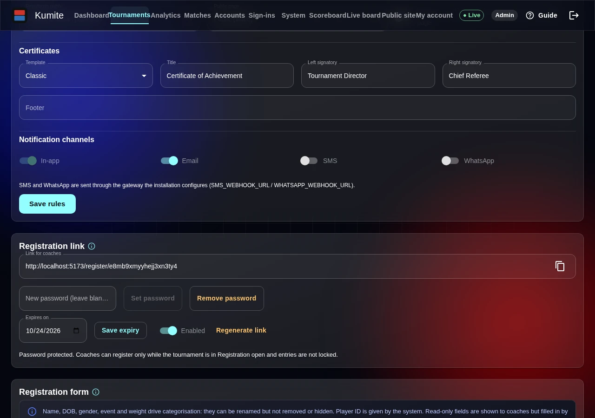

*Settings, Registration link: copy the link, set a password and an expiry, or regenerate it.*

- **Regenerate link** makes a new link; the old one stops working.
- Coaches can register only while the tournament is in Registration open, within the opening and closing date and time (in the tournament's time zone), and while entries are not locked.
- **Soft-lock coach entries** (Dashboard), or a "Coach entries lock at" time (Settings), stops coaches early while the office can still make changes.

### What a coach does

1. Open the link and enter its password. More than 10 tries in a minute are refused.
2. **Register the team**: team name, club or dojo, club code, head coach, contact person, mobile, email, district, state, country and address. Read the rules and terms, tick "I have read and accept", and press **Register team**.
3. **Add players**, one by one: name, date of birth, gender, club, country, events (Kata, Kumite or both), weight for Kumite, and any extra fields the organiser added.
4. Add **team members**: team manager, coach, judge or referee (one person can hold several roles).
5. Watch each player's status. A rejected or returned player shows the reason; fix it and send it again.

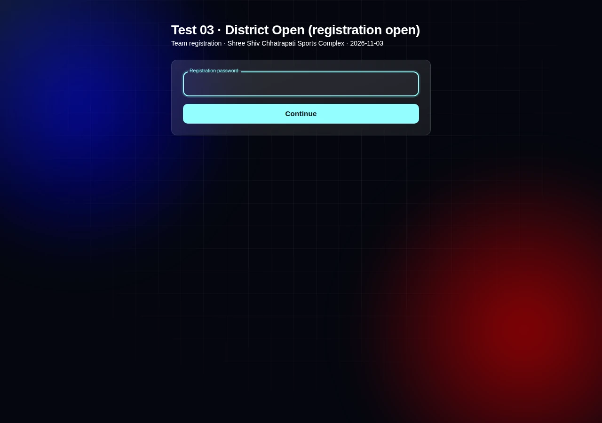

*The coach opens the link and enters its password.*

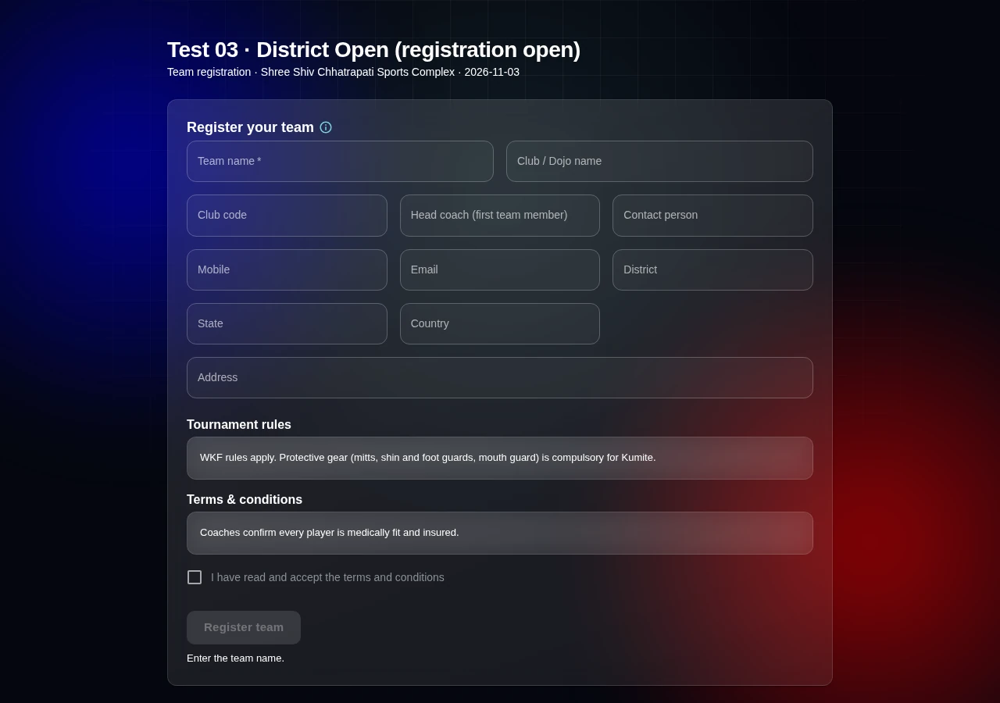

*The coach registers the team, then adds players.*

### The registration form

**Settings → Registration form** decides which player fields exist. These are the built-in fields:

| Field | Required | Notes |
| --- | --- | --- |
| Player Name | Yes | 2 to 100 characters |
| Player ID | — | Given by the system (P-0001, P-0002 …), read-only |
| DOB | Yes | A real date, not in the future |
| Gender | Yes | M or F |
| Club / School / Dojo | Yes | Up to 200 characters |
| Country | Yes | Must be a recognised country |
| Event | Yes | Kata, Kumite or both; only events the tournament holds |
| Weight (kg) | For Kumite | A positive number, with at most the allowed decimal places (default 1) |
| Father Name, Mother Name | No | 2 to 100 characters when given |
| Mobile, Emergency Contact | No | Digits, spaces or dashes, optional leading +, 7 to 17 characters |
| Email | No | A valid email address |
| Player Photo, ID Proof | No | PNG, JPEG or PDF, up to 2 MB |
| State, District | No | State must belong to the chosen country |
| Coach Name, Division, Federation ID | No | Division separates players (for example Novice and Advanced) |
| Belt | No | White to Black |
| Blood Group | No | A+ to O- |
| Age, Category | — | Worked out by the app |

- Organisers can add, remove, reorder and rename fields, make them required or optional, show or hide them, or make them read-only (coaches see them; the office fills them in).
- Field types: text, long text, number, date, dropdown, radio, checkbox, multi-select, file, phone, email, country, state, district and calculated.
- Name, DOB, gender, events and weight drive categorisation: they can be renamed but not removed.

### Check and approve entries

The **Registrations** tab has five lists: Players, Teams, Team members, Possible duplicates and Bulk upload. Filter by status, gender, event, team, age group, weight, district or state, or search by name, ID, team or club.

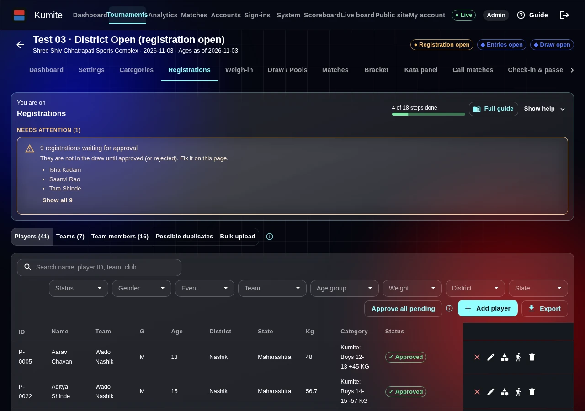

*Registrations: Needs attention lists the players waiting; the row buttons approve, reject, edit, change category or withdraw.*

| Action | What it does | Needs |
| --- | --- | --- |
| Approve | The player can enter the draw | — |
| Approve all pending | Approves every player waiting | — |
| Reject | Keeps the player out of the draw | A reason |
| Request correction | Sends the entry back to the coach | A reason |
| Approve a rejected player again | Reverses a rejection | A reason |
| Edit | Changes the player's details | Entries not locked |
| Change category / Fix category | Places the player in another category | — |
| Withdraw (injury, no-show) | Takes the player out; their remaining bouts are lost by withdrawal | A reason |
| Delete | Removes the entry | — |
| Add player / Add team | Office entry; goes straight to Pending verification | Entries not locked |

Only the actions that make sense for a player's current status are shown.

### Possible duplicates

The same name and date of birth (and the same club, when both have one), or the same Federation ID, is flagged as a possible duplicate. The person entering it must confirm it, and it is listed under **Possible duplicates** for review. The setting "Allow possible duplicates without review" turns this off.

### Bulk upload

Upload a spreadsheet with one row per player under **Bulk upload**. The preview lists every error by row. Nothing is imported until the file has no errors, and possible duplicates must be confirmed.

### Close registration

Press **→ Registration closed** on the Dashboard. Coach registration also stops by itself at the closing date and time.

## 6. Step 4 — Weigh-in (Kumite)

The weigh-in officer records each Kumite player's actual weight. If the weight fits another class, the app moves the player there; if it fits no class, the weigh-in cannot pass until a class is added. Kata players are not weighed.

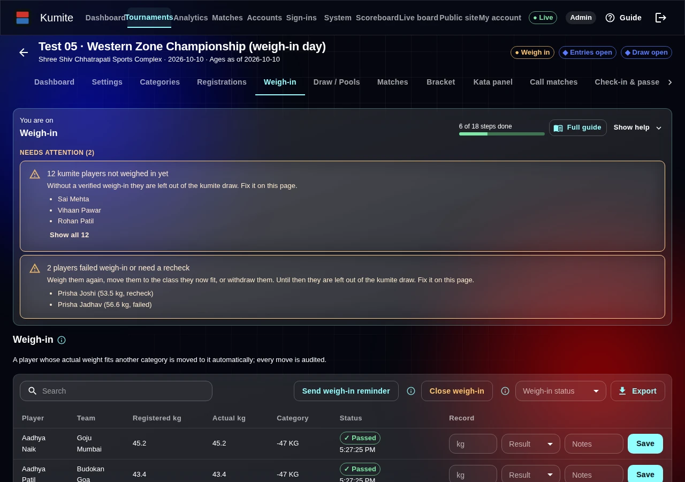

*Weigh-in: Needs attention lists players not weighed yet and failed weigh-ins; each row records one weight.*

### Record weights

1. Optional: on the Dashboard, move the tournament to **→ Weigh in**, and press **Send weigh-in reminder** on the Weigh-in tab. Every team with players still to weigh gets a message.
2. On the **Weigh-in** tab, find the player (search or filter by status).
3. Enter the actual weight in kg, choose the result (Passed, Failed or Recheck), add notes if needed, and press **Save**.
4. When everyone is done, press **Close weigh-in**.

### What the app does with the weight

- **Still fits the class**: Passed, no change.
- **Fits another class**: the player moves to that class automatically (setting "Weigh-in may move a player", on by default). The move is written to the audit log.
- **Fits no class**: Passed is refused with "No weight class covers this weight". Add the missing class in Categories, or move or withdraw the player.
- **Failed or Recheck**: the player stays out of the draw until weighed again, moved or withdrawn.

### Rules

- Only players entered in Kumite can be weighed in.
- The weight must be above 0 kg, with at most the allowed decimal places (default 1).
- Weights cannot change once entries are locked.
- After **Close weigh-in**, only an admin with the weigh-in override privilege can record a weight, and Notes must give the reason.
- With "Only verified weigh-ins enter the draw" on (the default), a Kumite player without a passed weigh-in is left out of the draw. Needs attention lists them.

## 7. Step 5 — Lock entries and draw

Locking entries freezes the player list. The draw then puts each category's players into pools or a bracket, and locking the draw lets you create the bouts. Each lock can be undone only with a reason.

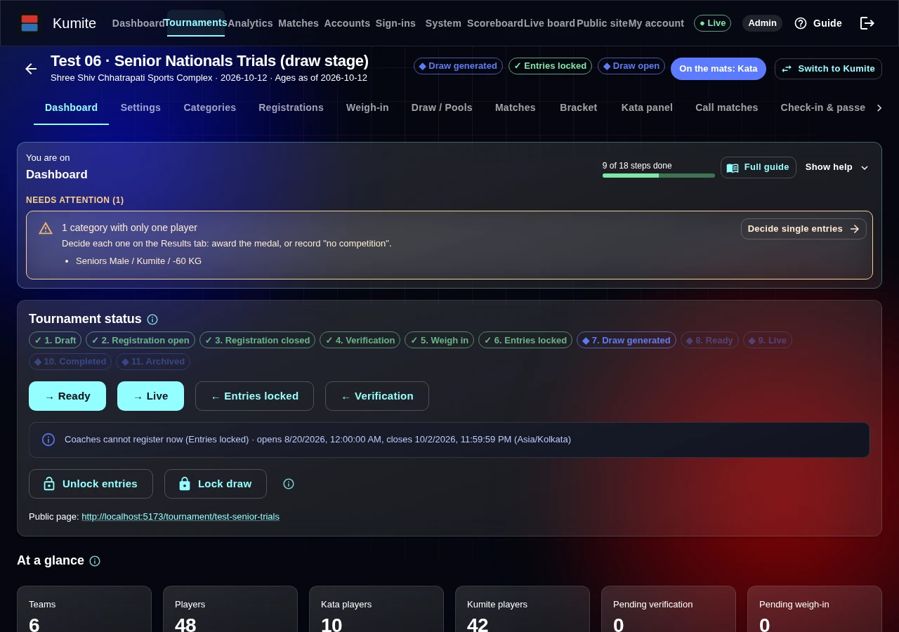

*The Dashboard during the draw: the stage chips, the next stages, and the lock buttons.*

### Lock entries

1. On the **Dashboard**, press **Lock entries**, or move the tournament to **→ Entries locked**. Moving to Entries locked or Live locks entries automatically.
2. Approved players now show as Locked. Nobody can add, edit or re-weigh players.
3. To undo, press **Unlock entries** and give a reason. This is refused once the draw is locked.

### Draw the pools (Draw / Pools tab)

1. **Categorise players**: press **Run categorisation**. Every approved player is placed by gender, age on the Master Age Calculation Date, event and weight.
2. **Draw pools**: press **Draw all categories**, or **Draw** on one category. **Redraw** replaces that category's pools.
3. **Lock the draw** on the Dashboard (**Lock draw**). Pools can no longer change.
4. **Generate matches** (Draw / Pools, step 3) creates every bout of every drawn category that has none yet.

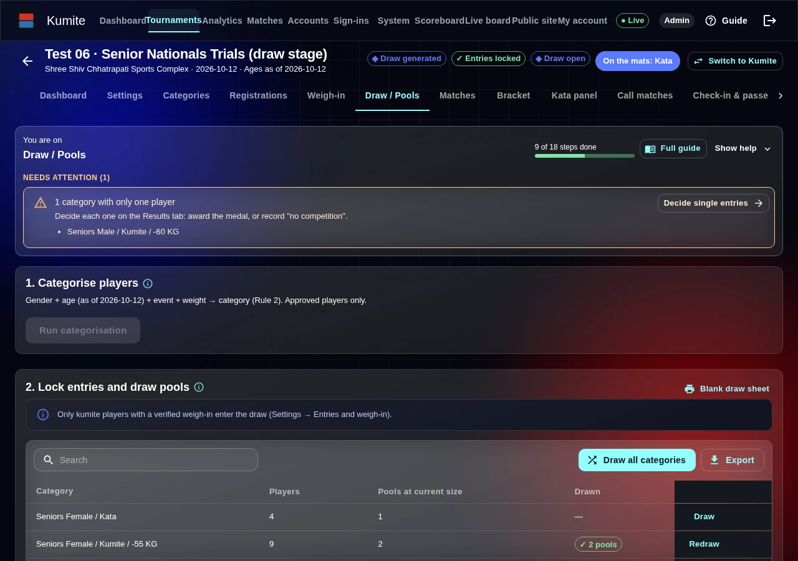

*Draw / Pools: categorise, draw each category, then generate the matches.*

How pools are made:

- A pool holds at most the maximum pool size (default 8). Uneven numbers are split as evenly as possible (20 players → 7 + 7 + 6), or into the fewest pools (17 → 9 + 8) if that option is chosen.
- The draw is random, or seeded (seeds placed first) when seeding is allowed.
- In a pool, everyone fights everyone once (round robin). Two players in a category fight one direct final.
- A category set to **straight knockout** goes to a bracket instead of pools, with byes for the top seeds.
- **Blank draw sheet** prints an empty sheet for manual use.
- A category with only **one player** cannot have bouts. Needs attention lists it; on the Results tab, award that player the medal or record "no competition".

Rules for the draw:

- Entries must be locked first, and the draw must not be locked.
- With "Only verified weigh-ins enter the draw" on, Kumite players without a passed weigh-in are left out and listed.
- Players can move only between pools of the same category, and only before the draw is locked.
- A redraw needs the redraw privilege and a confirmation. It is impossible once any bout in that category has a result.
- A bracket that needs byes is refused when byes are switched off.
- Unlocking the draw needs a reason.

### The bracket (Bracket tab)

Pools feed a knockout bracket: by default the top 2 of each pool qualify. Qualifiers can also be chosen by a points threshold, or by the admin. The final stage can be a knockout bracket or one final round-robin pool.

1. When every bout of every pool is finished, press **Generate final stage** on the Results tab.
2. The bracket fills itself. A bout is created as soon as both corners are known, and each winner moves to the next round.
3. With the third-place match on, the two semi-final losers meet for bronze.

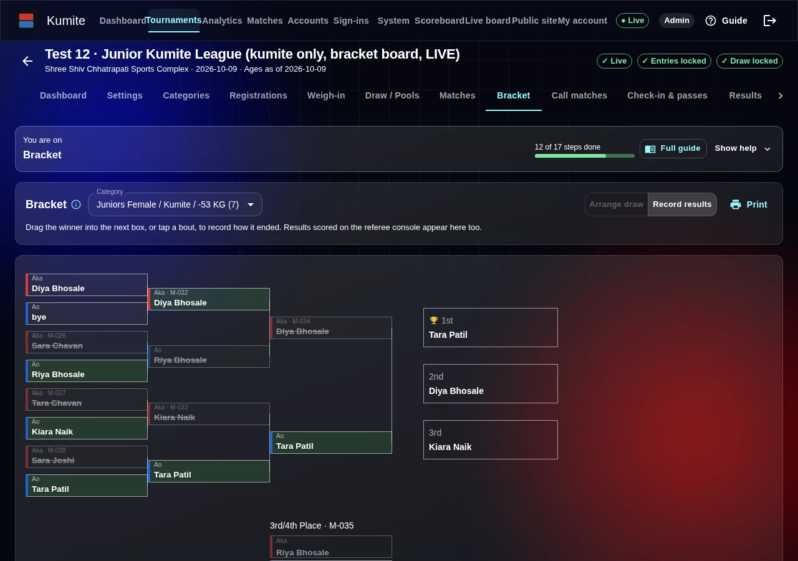

*Bracket board: winners move along the rounds; podium on the right; print for the mat table.*

On the Bracket tab:

- **Arrange draw**: drag a player to another first-round place. An empty place is a bye. Every first-round bout needs at least one player. Allowed until the first bout of the bracket starts.
- **Record results**: drag the winner into the next box, or tap a bout to record how it ended. Results scored on the console appear here too.
- **Print**: the paper draw sheet.

## 8. Step 6 — Matches: mat, time and officials

On the Matches tab every bout gets a mat, a start time, a referee and judges. The app refuses a time that would put a mat, an official or a player in two bouts at once.

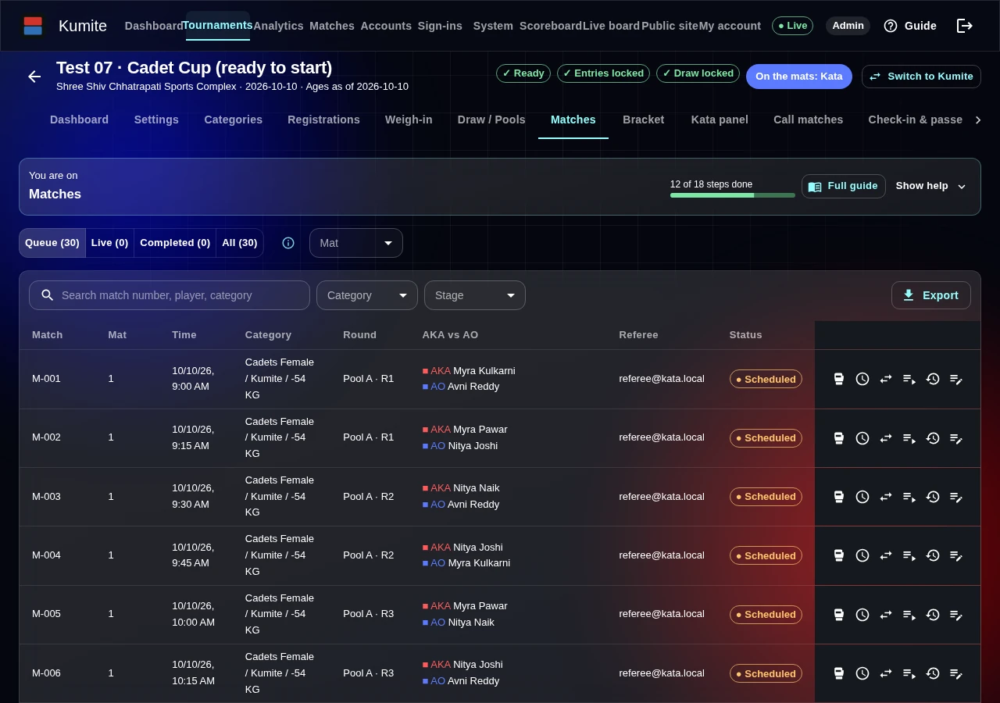

*Matches: the queue of bouts with mat, time, category, round, players, referee and status.*

### Find a bout

- Views: **Queue** (not started), **Live**, **Completed**, **All**. Filter by mat, category or stage; search by match number (M-001), player or category.
- Match numbers run M-001, M-002 … across the whole tournament, in the order bouts are created. Each number is used once.
- When matches are generated, categories are spread over the mats in turn (first category Mat 1, second Mat 2, and so on).

### Row buttons

| Button | What it does |
| --- | --- |
| Open scoring console | Opens the bout on the referee console (Step 7) |
| Schedule | Sets mat, referee, judges and time |
| Swap AKA and AO | Swaps the corners; only before the bout starts |
| Change status | Called, Ready, Open, Live, Paused, or back to Scheduled |
| Live score log | Every score, penalty and correction made on the console, with who and when |
| Enter result / Correct result | Records how a bout ended without the console, or corrects a finished one |

### Schedule a bout

1. Press **Schedule** on the bout.
2. Choose the **Mat** (1 to the number of mats in Settings), the **Referee** (a referee or admin account) and the **Judges** (judge accounts).
3. Enter the **Time**. It is the local clock of the device you are using, which should be the venue's.
4. Press **Save**.

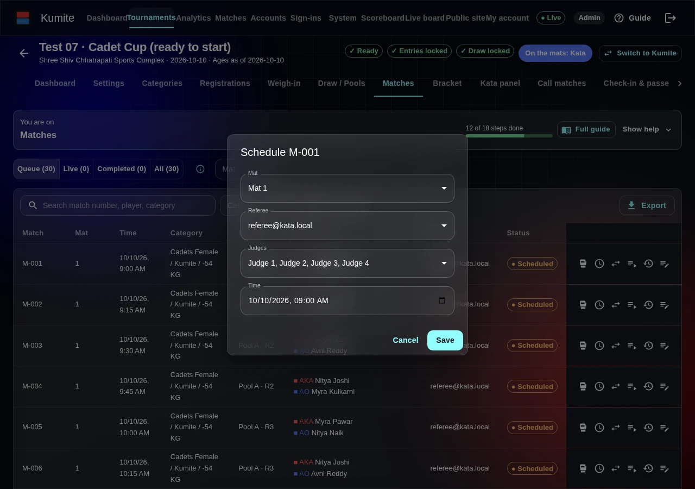

*The schedule dialog: mat, referee, judges and time.*

The app refuses the schedule, keeps what you typed and says who clashes, when:

- the mat already has a bout at that time;
- the referee or a judge is already on another bout at that time;
- the player has a bout in their other event (Kata or Kumite) at that time.

Other checks: the referee cannot also sit on the judging panel, one judge cannot take two seats, and there cannot be more judges than the panel has seats.

### Officials see their bouts

A referee's home screen lists the bouts assigned to them, by mat and time. With "Referees and judges see only the matches they are assigned to" on (Settings), that is all they see.

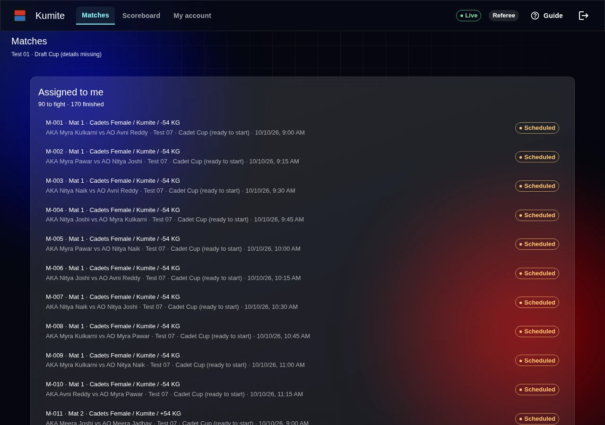

*The referee's home screen: the bouts assigned to them.*

### Enter or correct a result by hand

Use **Enter result** when a bout is decided off the console. Choose how it ended:

| Result | Meaning | Needs |
| --- | --- | --- |
| Fought (points / decision) | Normal end, with the scores | — |
| Walkover | The opponent withdrew or was absent | A finish reason |
| No-show | The opponent did not report | A finish reason |
| Kiken | The opponent forfeited | A finish reason |
| Disqualification | The opponent was disqualified | A finish reason |
| Manual decision | An official override | A finish reason and the result-override privilege |
| Cancelled | No result; counts for nobody | — |

- Changing a finished bout needs a reason and the score-correction privilege. Both are written to the audit log.
- Once a category's results are published, a change also needs the result-override privilege. Once results are locked, nothing changes until the tournament goes back to Live (with a reason).
- A bout that was fought can be deleted only by an admin, with a reason and the correction privilege, and never from a locked draw.

## 9. Step 7 — Competition day

On the day the tournament goes Live and runs one event at a time. The announcer calls bouts to each mat, referees score on the console, judges score kata, and the hall screens follow every score.

### Before the first bout

1. **Passes (optional)**: on **Check-in & passes**, tick who gets a pass (athletes, team managers and coaches, judges and referees), press **Generate passes**, then **Download PDF**. Each pass has a photo, role and QR code, eight to an A4 page.
2. **Check-in**: at the door, press **Scan with camera** or type the pass code. Choose "At the door (arrival)" or "At the mat (next bout)".
3. **Go live**: on the Dashboard, press **→ Live**. Entries lock automatically.
4. **Hall screens**: open each screen's address on its TV (see Hall screens below).

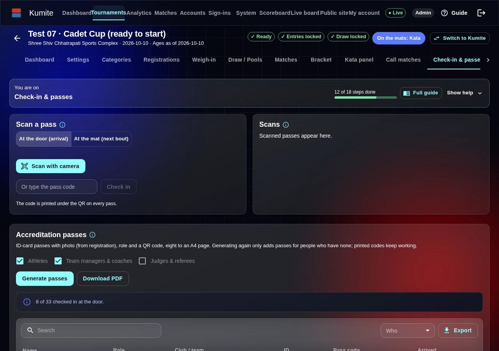

*Check-in & passes: scan a pass at the door or the mat; generate and print passes.*

### Kata and Kumite take turns

A Kata + Kumite tournament has one event on the mats at a time. The chip at the top shows it ("On the mats: Kumite"); Settings decides which goes first (default Kata).

- Press **Switch to Kata** or **Switch to Kumite** at the top of any tab when the session changes.
- Switching is refused while the current event has a bout called, ready or live, or a kata round open.
- A bout of the other event cannot be called, started or scored until its session begins.

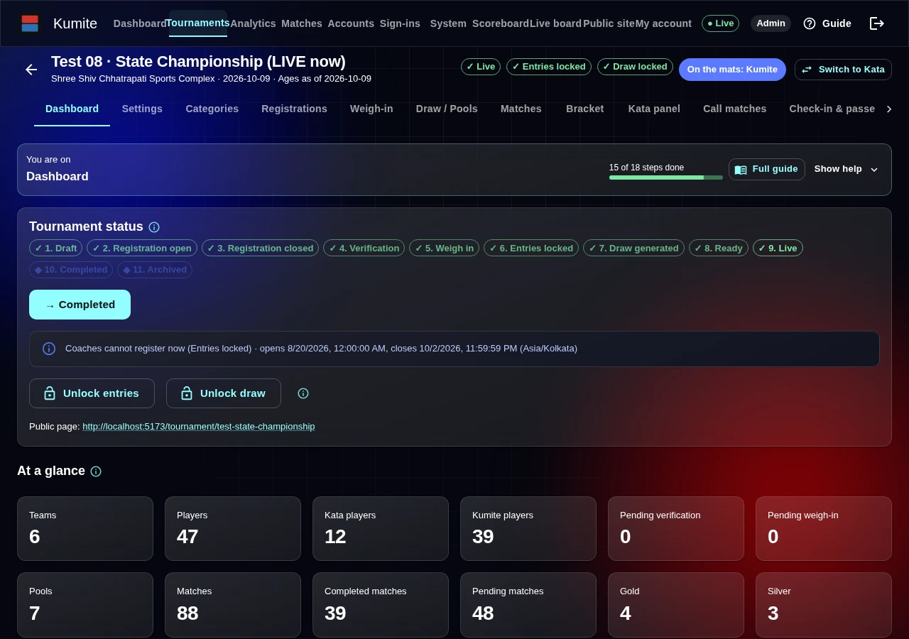

*A live tournament's Dashboard: Kumite is on the mats; the switch is at the top right.*

### Call the bouts (announcer)

The **Call matches** tab has one column per mat: the bout on the mat now, then the next bouts of the event on the mats.

1. Press **Call** on the next bout. Its status becomes Called and the players are told to come. **Call again** repeats it and shows how long ago the first call was.
2. Mark each corner **Present** or **Absent** as they arrive. When both are present the bout is Ready.
3. An absent player is recorded as a no-show by the referee.
4. **To mat** moves a bout to another mat when one runs ahead.

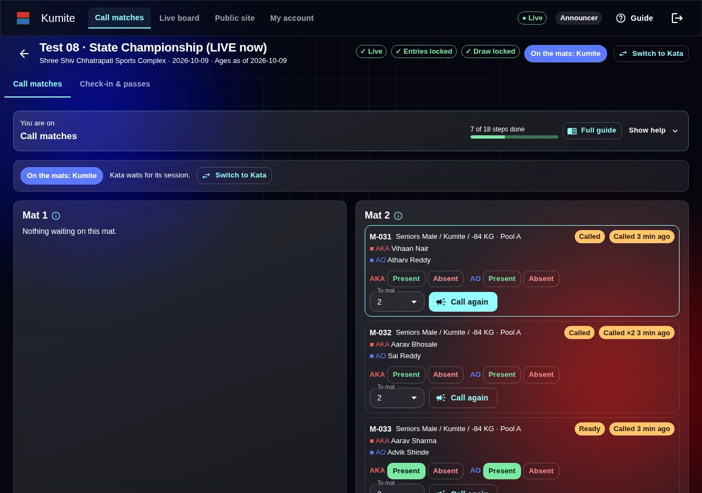

*Call matches: each mat's bout on now and the bouts called next, with attendance.*

### Score a bout (referee console)

The referee opens the bout from their home screen, or an admin presses **Open scoring console** on the Matches tab. Ao (blue) is on the left, Aka (red) on the right, the clock in the middle.

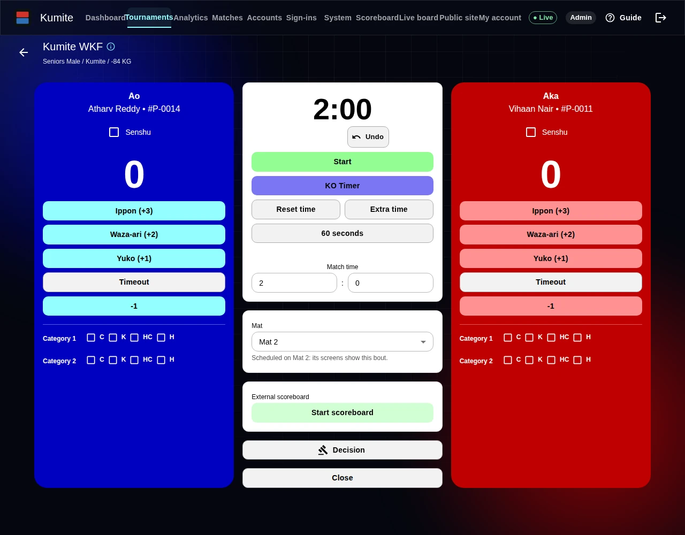

*The scoring console. The Mat box starts on the mat the bout is scheduled on.*

| Control | What it does |
| --- | --- |
| Start / Stop | Starts and stops the bout clock |
| Ippon (+3), Waza-ari (+2), Yuko (+1) | Adds points, at this tournament's values |
| −1 | Takes one point off |
| Senshu | Marks the first unopposed score; the first score sets it automatically |
| Timeout | Records a timeout for that corner |
| Category 1 / 2: C, K, HC, H | Penalties. Pressing the level already set steps it back |
| Undo | Reverses the last action |
| KO Timer | Runs the knock-down timer |
| Reset time, Extra time, 60 seconds, Match time | Clock controls; match time is set before the start |
| Mat | Which screens show this bout. Starts on the scheduled mat; another mat asks first |
| Start scoreboard / Close scoreboard | Shows or hides this bout on the hall screens |
| Decision | Kiken (withdrawal), Shikkaku (disqualification) or Hantei (referees' decision) |
| Close | Confirms the result and saves it |

How a bout ends:

1. A fighter whose penalties reach **H** in any category loses (hansoku).
2. A lead of **8 points** (the winning point gap) ends the bout at once.
3. At **time up** the higher score wins. If level, the senshu holder wins (when senshu applies). Otherwise the "tie at time" setting decides: extra time, golden score (the first score in extra time wins), a referees' decision, or a draw.
4. The referee confirms with **Close**; the result goes to the bracket and standings straight away.

Safety rules on the console:

- While the clock runs, Reset time, Extra time, 60 seconds, KO Timer, the scoreboard switch, the mat and Close ask for confirmation. Scoring and Stop never do.
- Only one device controls a mat. Any other device shows the console read-only, with **Take over** for a referee or admin.
- If the connection drops, keep scoring: the actions are sent, in order and with their times, when it returns.
- A score sent to a finished bout is refused and recorded.

### Kata (panel tab and judges)

1. On **Kata panel**, press **Open round 1** for a kata category. The app draws the performing order.
2. Seat the judges (3 to 7, one judge per seat) and press **Start round**.
3. Each judge opens **Kata scoring** and scores every performer: 5.0 to 10.0 in steps of 0.1 by default. A score is locked once sent.
4. When every judge has scored every performer, complete the round. The best performers (default 8) go to the next round, up to the final.

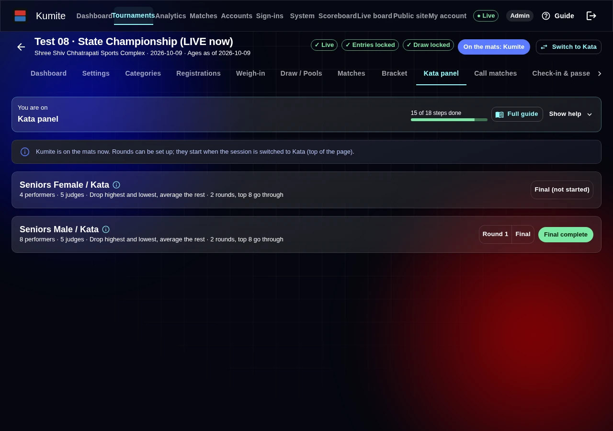

*Kata panel: each kata category's rounds, from round 1 to the final.*

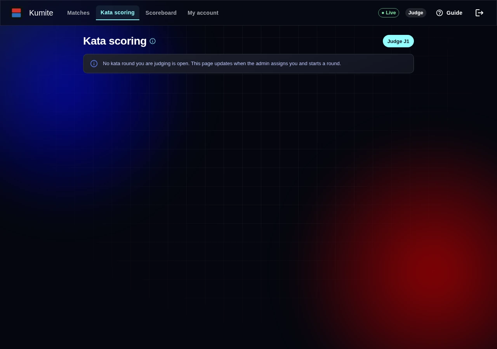

*A judge's screen waits until the admin starts a round they are seated on.*

- The final score drops the highest and lowest score and averages the rest (other methods in Settings).
- Ties are broken by the higher total of all scores, then the best single score (other options in Settings).
- Only judges seated on the round can score it, and a judge cannot be changed once their seat has scored.
- Kata rounds can be set up during the Kumite session but not started.

### Hall screens and public pages

| Screen | Address | Shows |
| --- | --- | --- |
| Mat scoreboard | `/display?mat=N` | That mat's bout: names, clubs, scores, senshu, clock, category, round and the next bout |
| Hall scoreboard | `/display` | The latest bout opened on any mat |
| Live board | `/live?t=<short name>` | Every mat: the bout on now and the next ones, latest results, brackets and kata results in turn |
| Public page | `/tournament/<short name>` | Information, categories, teams, players, draw, live matches, results and medal tally |
| Scoreboard control | `/scoreboard_operator` | What the hall shows now, announcements to the hall or one mat, links to every screen |

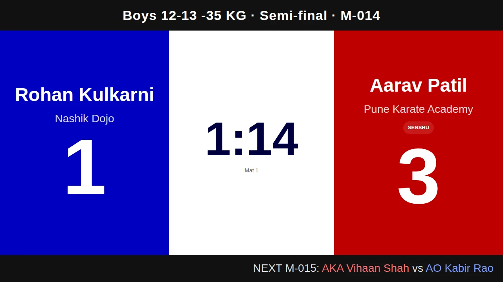

*A mat scoreboard on the hall TV.*

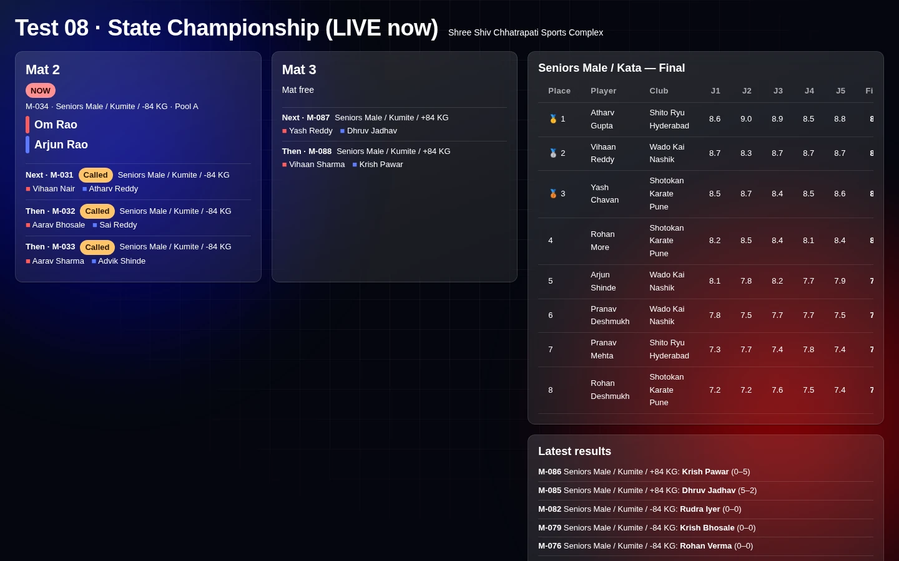

*The live board: each mat's bout and the next ones, beside the latest kata final.*

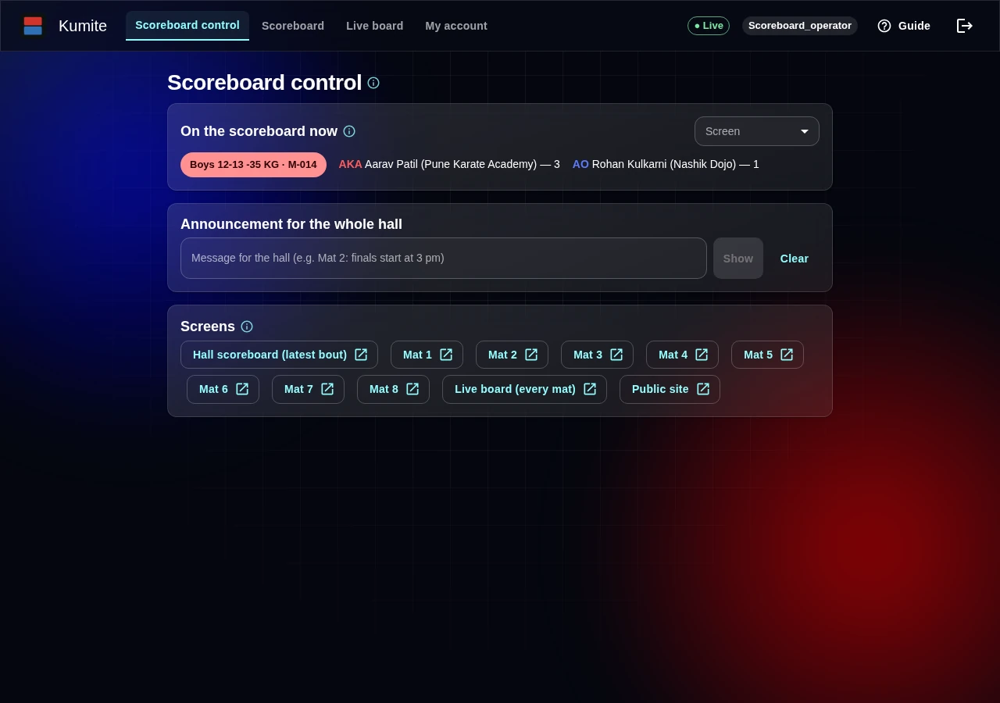

*Scoreboard control: the current bout, an announcement for the hall, and the screen links.*

- Screens need no sign-in and update by themselves. A mat screen receives each score as it happens.
- A scoreboard shows **NOT LIVE** when the console has sent nothing for 5 seconds (a dropped connection).
- During the Kata session the live board says "Kata is on the mats now" instead of listing Kumite bouts.
- The public page shows only published results. A private tournament has no public page; an unlisted one is reached only by its link.

## 10. Step 8 — Results, certificates and reports

Each category's result moves from Provisional to Verified, Published and Locked. Only published results reach the public page. Certificates and reports are made from the final results.

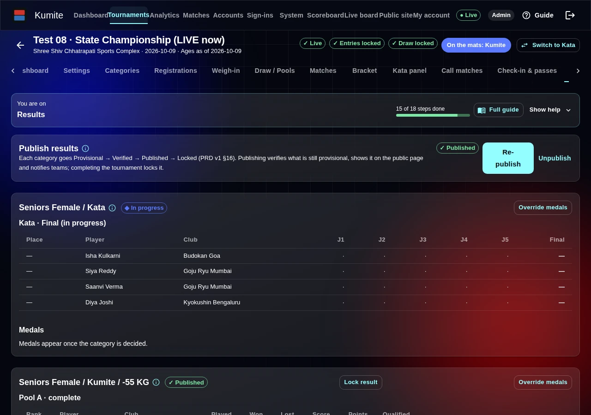

*Results: publish for the whole tournament; each category shows its stage, standings and medals.*

### Result stages

| Stage | Meaning | How it is reached |
| --- | --- | --- |
| In progress | Bouts are still to be fought | — |
| Provisional | Every bout is decided; standings and medals are worked out | Automatic |
| Verified | An admin has checked it | Verify on the Results tab |
| Published | Shown on the public page; teams are notified | **Publish results** (or automatically when verified, if Settings says so) |
| Locked | Cannot change | **Lock result** on one category, or completing the tournament |

- Pool standings: 3 points for a win, 1 for a draw. Ties are broken in this order: points, wins, head-to-head, score difference, scores for, fewer penalties.
- Medals: gold, silver and two bronzes by default (or one bronze, from the third-place match).
- **Generate final stage** appears when every pool bout of a category is finished (Step 5).
- **Decide single entries**: a category with one player is awarded the gold or recorded as "no competition".
- **Override medals** changes a medal by hand; it needs the result-override privilege and a reason.
- **Unpublish** takes results off the public page; **Re-publish** puts them back.
- Unlocking a locked result needs a reason. After the tournament is Completed, results change only after moving it back to Live (reopen privilege and a reason).

### Certificates

1. On **Certificates**, tick who gets one: medal winners, participation (every player who took part), team managers and coaches, judges and referees.
2. Press **Generate**. Use **Special award…** for an award of your own.
3. Press **Download PDF** or **Print / save as PDF**.

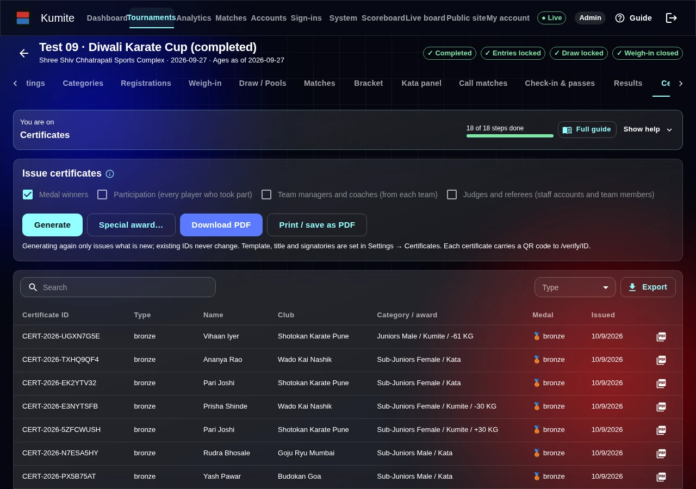

*Certificates: choose who gets one, generate, then download or print.*

- Each certificate has an ID (CERT-2026-…) and a QR code that opens `/verify/<ID>`, where anyone can check it is genuine.
- Generating again issues only what is new; existing IDs never change.
- Template, title, signatories and footer are set in Settings → Competition rules → Certificates.
- Players can download their own from the public page when "Players can download certificates from the public page" is on.

### Reports

**Reports** has the registration, player, team, category, weigh-in, pool, match, result, final result, medal, medal tally and attendance reports. Each downloads as Excel, CSV or PDF. Filter first by gender, event, age group, category, club, district or state.

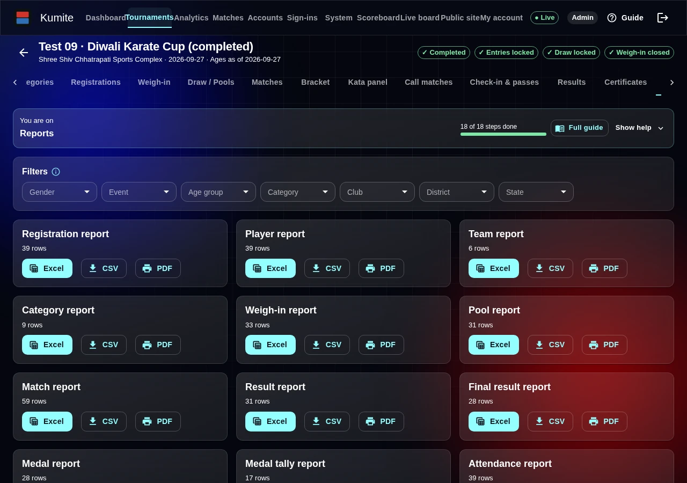

*Reports: filter, then download each report as Excel, CSV or PDF.*

Every list in the app also has its own **Export** button. Every export is recorded in the audit log.

### Audit log

The **Audit log** tab lists every change in the tournament: when, who, what changed (old → new), the reason given, and the device's address. Search it, or export it.

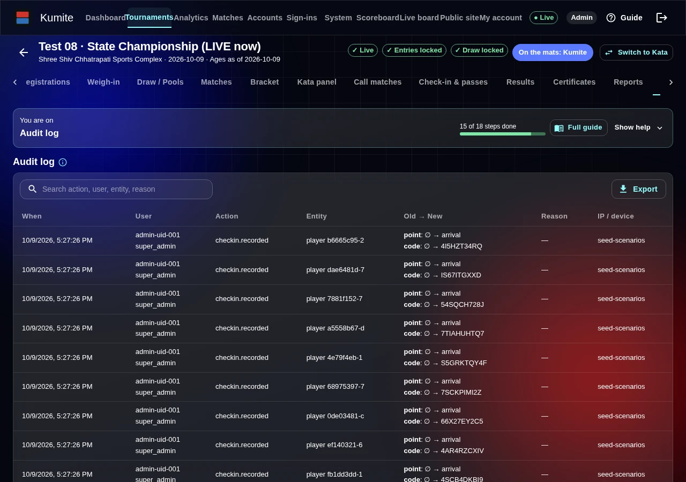

*Audit log: who changed what, when and why.*

### Complete and archive

1. On the Dashboard, press **→ Completed**. Every published result is locked.
2. Later, press **→ Archived**. The tournament becomes read-only history.
3. Reopening a completed tournament (back to Live) needs the reopen privilege and a reason. An archived tournament cannot be reopened.

## 11. Administration

Admins manage staff accounts and watch sign-ins. The super admin also takes backups and manages rulesets and organisations. Everyone manages their own password, two-step sign-in and devices under **My account**.

### Accounts

1. Open **Accounts** and press **New account**.
2. Enter the email and a password (8 to 200 characters), and choose the role.
3. For a judge, give the seat number (1 to 99). Optionally limit the account to some tournaments (empty means all), or give it a different role inside one tournament.
4. Press Save, then give the person their email and password.

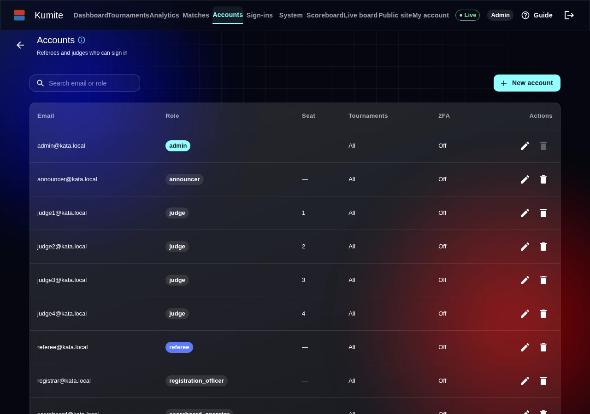

*Accounts: every staff account with its role, judge seat, tournaments and two-step sign-in.*

- Each email can have only one account.
- Nobody can change their own role; another admin must.
- Only a super admin can create another super admin.
- An official still on unfinished bouts cannot be removed until someone else is put on those bouts (Matches tab).
- A team manager can make their own login from the registration page (**Create my own login**). It opens their team only, in that tournament only.

### Sign-ins

**Sign-ins** lists every sign-in attempt, accepted or refused: when, which account, the outcome, the role, the address, the location if the browser shared it, and the device. Filter by account or outcome.

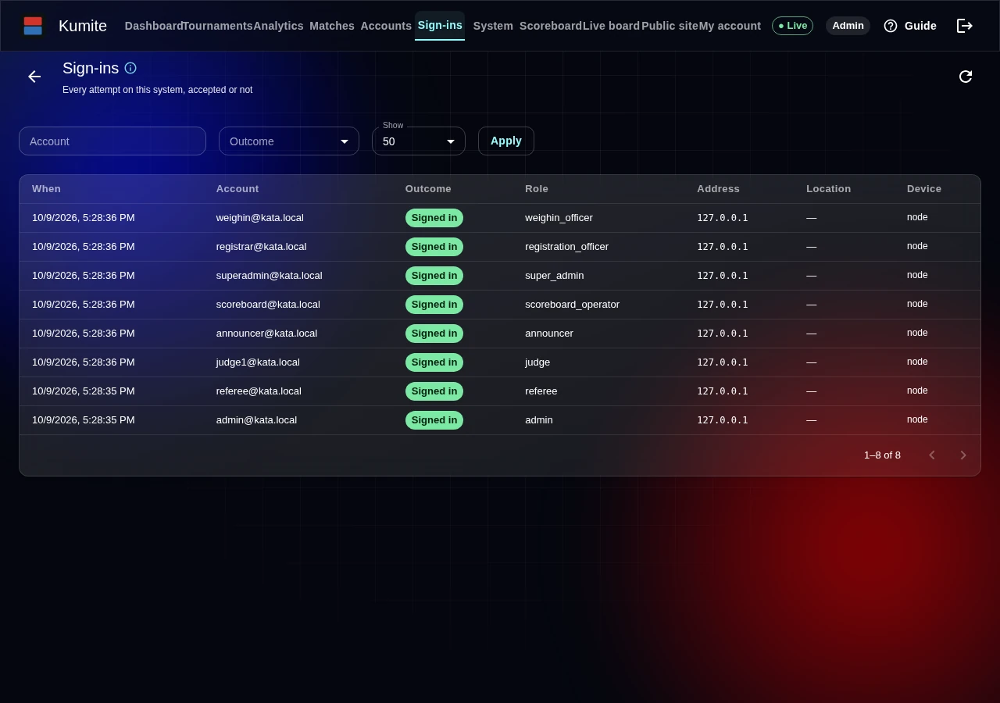

*Sign-ins: every attempt, accepted or not.*

### Dashboard and Analytics

- The **Dashboard** counts tournaments, teams, players, entries, approvals waiting, weigh-ins pending, live and finished matches, and medals. Each tournament row links to Manage, Matches and Results.
- **Analytics** compares clubs (entries, medals, wins, losses, win rate), athletes (one athlete across tournaments, by name and date of birth) and tournaments. Each list exports.

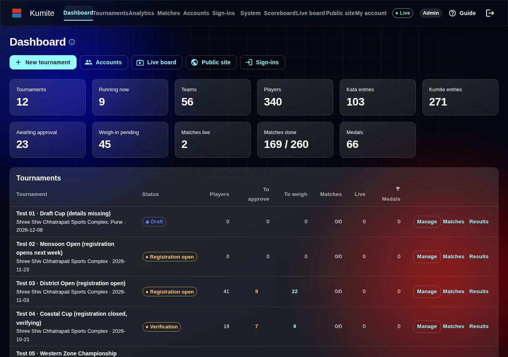

*The admin Dashboard: the whole system at a glance.*

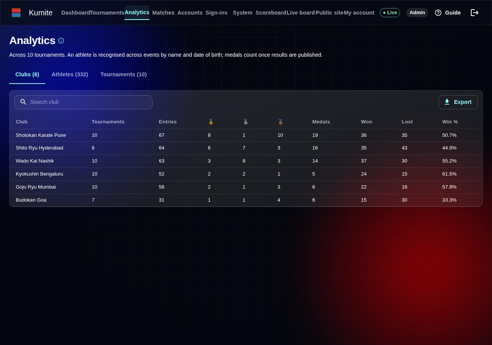

*Analytics: clubs across all tournaments.*

### System (super admin)

- **Download backup** saves everything as one JSON file, accounts included. Password hashes stay hashed, and two-step sign-in secrets are left out.
- To restore, run `npm run restore -- <file>.json` on the server. It refuses a database that already has data unless `--replace` is added. Schedule `npm run backup` for automatic backups.
- The audit trail here lists system events outside tournaments (accounts, sign-ins, backups).

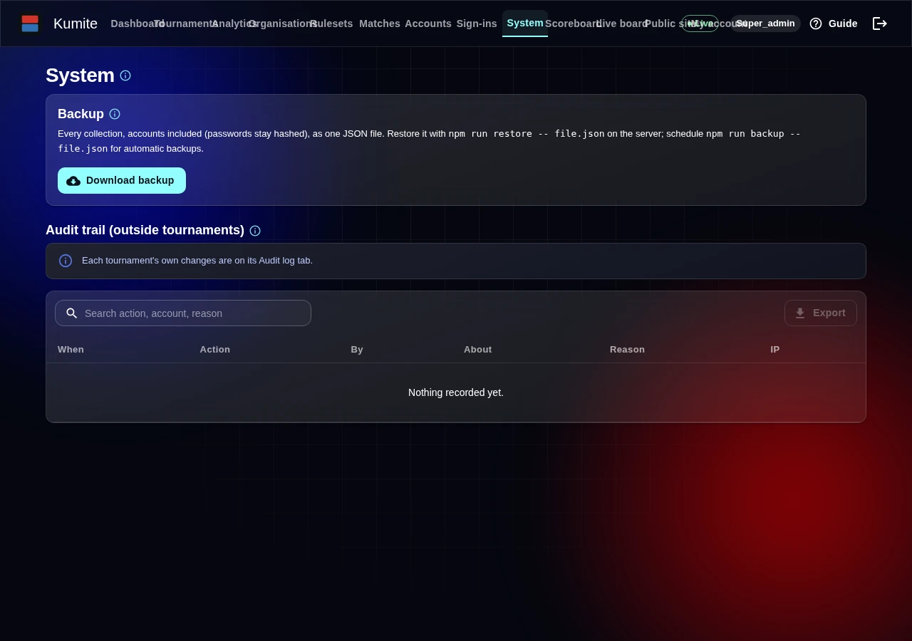

*System: backup, and the audit trail outside tournaments.*

### Organisations (super admin)

Each organisation runs its own tournaments. Give it an admin on the Accounts page; tournaments that admin creates belong to the organisation, and its public list is at `/tournaments?org=<short name>`. An account never reaches another organisation's tournaments.

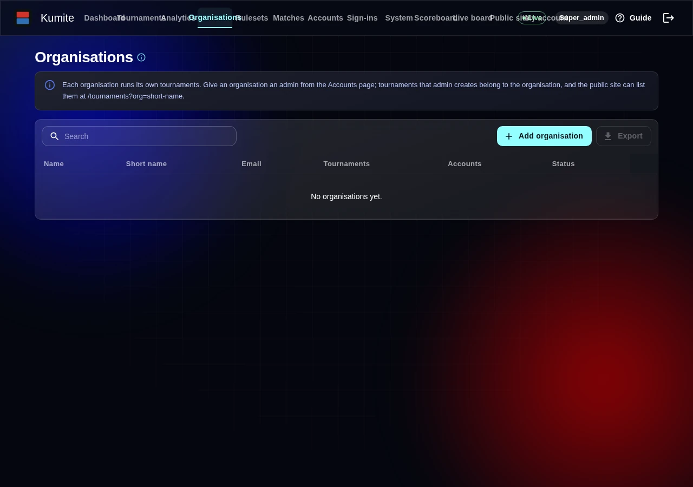

*Organisations: one per federation or association using the app.*

### Rulesets (super admin)

A ruleset is a named set of competition rules a tournament applies in Settings. Three standard ones ship with the app:

| Ruleset | Kumite | Kata |
| --- | --- | --- |
| WKF (standard) | 180 s bouts, 8-point gap, senshu decides a tie | 5 judges, scores 5–10 |
| WKF kata — technical / athletic | 180 s bouts, 8-point gap, senshu | 7 judges, technical and athletic scored separately |
| Youth / club (2-minute bouts) | 120 s bouts, 6-point gap, golden score | 3 judges, scores 5–10 |

Editing a ruleset saves a new version. Tournaments keep the version they applied until they apply it again. A standard ruleset can be edited or restored, but not switched off.

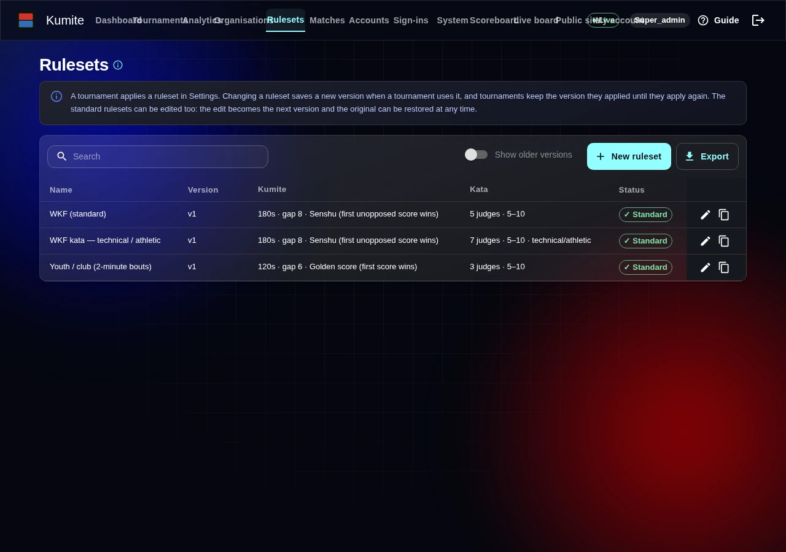

*Rulesets: the standard sets and their versions.*

### My account

- **Two-step sign-in**: press **Set up two-factor sign-in**, add the key to an authenticator app (Google Authenticator, Microsoft Authenticator, 1Password), and enter the 6-digit code it shows. Turning it off needs a current code. Recommended for every admin.
- **Where you are signed in**: each device, its address, when it signed in and was last active. **Sign out** ends one device; **Sign out everywhere else** ends all the others and says how many.

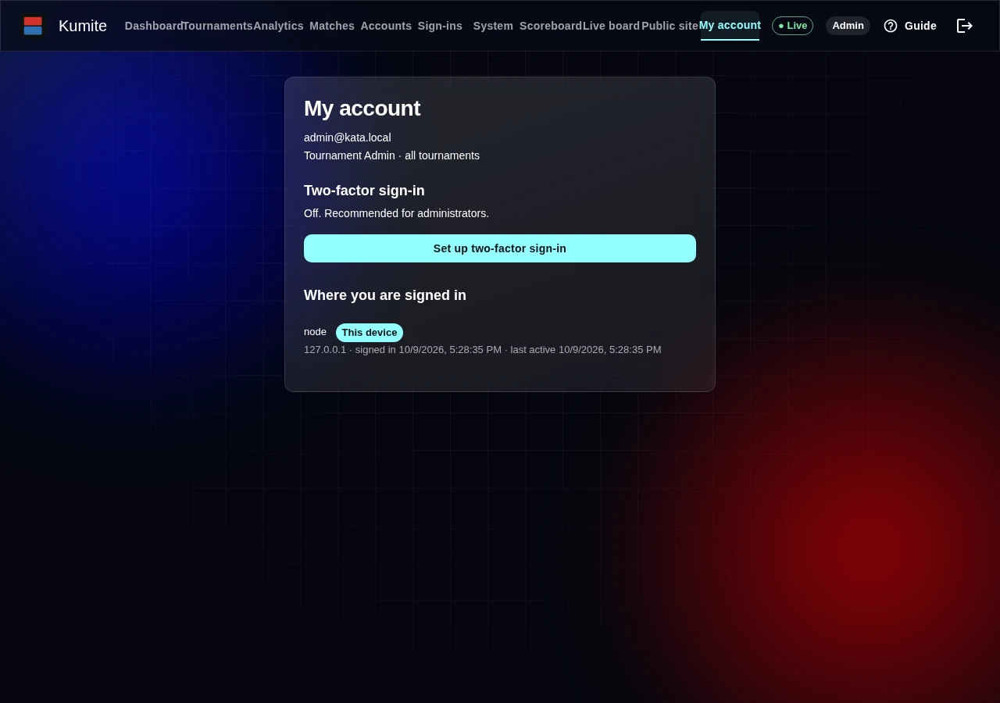

*My account: two-step sign-in and the devices signed in.*

## 12. Validation rules

The app checks every action on the server, so a rule cannot be skipped from any screen or device. A refused action changes nothing and says why (section 13 lists the messages and fixes).

### Tournament details and stages

| Rule | Detail |
| --- | --- |
| Name, organizer | 2 to 150 characters |
| Venue | 2 to 200 characters |
| Dates | The end date cannot be before the start date |
| Registration window | Must close after it opens, and by the last day of the tournament. Dates are read in the tournament's time zone |
| Weigh-in date | On or before the last day of the tournament |
| Contact | Mobile: digits, spaces or dashes, optional +, 7 to 17 characters. Email: a valid address |
| Opening registration | Needs name, organizer, venue, start and end dates, Master Age Calculation Date, registration opens and closes, type, contact mobile and email, and an active ruleset |
| Stage order | Draft → Registration open → Registration closed → (Verification) → (Weigh-in) → Entries locked → Draw generated → (Ready) → Live → Completed → Archived. Only the moves offered on the Dashboard are possible |
| Going back a stage | Needs a reason |
| Completed → Live | Needs the reopen privilege and a reason |
| Archived | Read-only; nothing can change |
| Automatic locks | Entries lock at Entries locked and at Live; published results lock at Completed |
| Tournament type | Cannot drop an event that players have already entered |
| Master Age Calculation Date | Changing it re-ages every player: a preview is shown and must be confirmed |
| Short name (public address) | Must be unique |
| Deleting | A live tournament cannot be deleted; complete it first |

### Categories

| Rule | Detail |
| --- | --- |
| Age group | A name; gender Boys/Men, Girls/Women or Mixed; youngest age 0 or more; oldest not below youngest |
| Age overlap | Two active groups of the same gender cannot share an age (Mixed counts as both), unless the overlap is confirmed |
| Weight class | A name, an age group, at least one limit; the upper limit above the lower |
| Weight overlap | Two active classes in one age group cannot overlap, unless confirmed |
| Own rules for a category | Pool size 2–64, match duration 30–600 s, point gap 0–20, qualifiers per pool 1–8, kata judges 3–7, kata qualifiers 1–64, kata rounds 1–5 |
| Changes | Not once entries are locked. A category with results cannot be deleted |

### Teams and team members

| Rule | Detail |
| --- | --- |
| Team name | Required; unique in the tournament (case, spaces, punctuation and accents ignored) |
| Contact | Mobile and email must be valid when given |
| Terms | A coach must accept the tournament's terms to register |
| One team per coach | A coach session registers one team |
| Inactive team | Cannot add players |
| Deleting a team | Not while it has players, unless the organiser gives a reason (its players are deleted too) |
| Team member | At least one role (Team Manager, Coach, Judge, Referee); one name once per team |

### Players and registration

| Rule | Detail |
| --- | --- |
| Required fields | Name (2–100 characters), date of birth, gender (M or F), club, country, event; others as set on the form |
| Date of birth | A real date, not in the future |
| Events | Kata, Kumite or both, and only events this tournament holds |
| Weight | Required for Kumite; above 0; at most the allowed decimal places |
| Age for a coach entry | Must fit an age group (once age groups exist). The office may enter the player anyway and sees a notice |
| Possible duplicate | Same name + date of birth (+ club), or same Federation ID: must be confirmed |
| Coach entries | Only while Registration open, inside the registration window, before the soft lock or the "coach entries lock at" time, with entries not locked |
| Office entries | Allowed until entries are locked |
| Reject, request correction | Need a reason |
| Approve a rejected player | Needs a reason |
| Draw | Only approved players (and later statuses) enter the draw |
| Withdraw | Needs a reason. After the draw, the player's remaining bouts are won by their opponents (kiken), and an unscored kata performer leaves the round |
| Change category after the draw | Unlock the draw first |
| Bulk upload | The whole file is refused if any row has an error |

### Weigh-in

| Rule | Detail |
| --- | --- |
| Who | Only players entered in Kumite |
| Weight | Above 0 kg, at most the allowed decimal places |
| Passing | The weight must fit a weight class of the player's age group |
| After entries lock | Weights cannot change |
| After weigh-in closes | Only with the weigh-in override privilege and a reason in Notes |
| Draw | With "Only verified weigh-ins enter the draw" on, Kumite players without a passed weigh-in are left out |

### Draw and brackets

| Rule | Detail |
| --- | --- |
| Drawing pools | Entries locked; draw not locked |
| Redraw | Needs the redraw privilege and a confirmation; impossible once a bout in the category has a result |
| Seeded draw | Only when seeding is allowed in Settings |
| Moving a player | Only between pools of the same category, before the draw is locked; a full pool takes nobody |
| Generating matches | The draw must be locked |
| Byes | Refused when byes are switched off and the bracket needs them |
| Final stage | Every pool bout finished; at least two pools; qualifiers chosen when selection is manual; at least two qualifiers |
| Arranging a bracket | Every player placed once; each first-round bout has at least one player; only before the bracket's first bout starts |
| Unlocking | Entries or draw: a reason. Entries cannot unlock while the draw is locked |

### Scheduling and bouts

| Rule | Detail |
| --- | --- |
| Clashes | A mat, a referee, a judge or a player cannot be in two bouts at the same time (a player across Kata and Kumite too) |
| Officials | Referee: a referee or admin account. Judges: judge accounts only. The referee is not also a judge; one judge, one seat; no more judges than seats |
| Tournament access | An official must be assigned to the tournament |
| Swap corners | Only before the bout starts |
| Status order | Scheduled → Called → Ready → Open → Live ⇄ Paused → Completed; Cancelled can return to Scheduled |
| Running event | Only bouts of the event on the mats can be called, started or scored |
| Attendance | Only when attendance is on in Settings |
| Removing an official | Not while they are on unfinished bouts |

### Scoring and results

| Rule | Detail |
| --- | --- |
| One device per mat | Other devices are read-only; a referee or admin can take over |
| Finished bout | New scores are refused and recorded |
| Correction of a finished bout | A reason and the score-correction privilege |
| Exceptional endings | Walkover, no-show, kiken, disqualification and override need a finish reason; override also needs the result-override privilege |
| Published result | Changes need the result-override privilege |
| Locked result | No change until unlocked (with a reason), or until the tournament moves back to Live |
| Offline scoring | Replayed on reconnection only if nobody else took the mat meanwhile |

### Kata

| Rule | Detail |
| --- | --- |
| Score | 5.0 to 10.0 in steps of 0.1 by default (range and 0–2 decimals set in Settings) |
| Panel | 3 to 7 judges; each judge needs a seat; one judge per seat |
| Who scores | Only the judges seated on that round, once the round has started; a sent score is locked |
| Changing a judge | Not for a seat that has already scored |
| Completing a round | Every judge must have scored every performer |
| Next round | The current round must be finished first |
| Session | Rounds start only while Kata is on the mats |

### Accounts, sign-in and files

| Rule | Detail |
| --- | --- |
| Password | Staff: 8 to 200 characters. A team manager's own login: 8 to 100 |
| Email | Valid and unique |
| Sign-in attempts | 10 per account per minute, 60 per address per minute |
| Password reset | The link works for 30 minutes; at most 5 requests per 15 minutes |
| Registration link password | At most 10 tries per minute |
| Two-step code | The current 6-digit code from the authenticator app |
| Sign-in length | 12 hours; signing a device out ends its session at once |
| Reach | An account limited to some tournaments, or to an organisation, cannot open others |
| Own role | Cannot be changed by yourself |
| Uploads (photo, ID proof, logo) | PNG, JPEG or PDF, up to 2 MB; the file's content must match its type |
| Request limits | 1,200 requests a minute per signed-in device; public pages and scoreboards 6,000 a minute per address |

## 13. Messages and what to do

When something is wrong, look first at **Needs attention** at the top of the tab; it names the problem and has a button to the fix. When an action is refused, the message says why. Both are listed here with what to do.

### Needs attention items

| Item | What to do |
| --- | --- |
| Registration cannot open yet: details are missing | **Fill in the details**: complete the fields it lists in Settings |
| No age groups yet | **Set up categories** on the Categories tab |
| Some kumite weights have no weight class | **Fix the weight classes**: add a class for each weight listed (for example "+40 KG") |
| Coaches cannot register: there is no registration link | **Generate the link** in Settings → Registration link |
| The registration link is switched off | Turn **Enabled** on in the link settings |
| Coaches cannot register yet | **Check the dates**: the registration window has not started |
| The registration closing date has passed | **Move the tournament on** to Registration closed |
| N registrations waiting for approval | **Review registrations**: approve, reject or request a correction |
| N players with no category | **Fix categories**: add the missing age group or weight class, or place the player by hand |
| N kumite players not weighed in yet | **Record weigh-ins** on the Weigh-in tab |
| N players failed weigh-in or need a recheck | Weigh again, move them to the class they now fit, or withdraw them |
| N categories not drawn yet | **Draw the pools** before locking the draw |
| N categories with only one player | **Decide single entries** on the Results tab |
| N kata categories waiting | **Open the Kata panel** and open round 1 |

### Setup and registration messages

| Message | What to do |
| --- | --- |
| Fill in the required tournament details first (Settings). | Fill in every field named under Needs attention, then try again |
| Set the Master Age Calculation Date first. | Settings → Tournament details → Master Age Calculation Date |
| That status change is not allowed from the current status. | Use only the stage buttons the Dashboard offers, one stage at a time |
| A reason is required for this action. | Type the reason in the box; it goes to the audit log |
| This age group overlaps another one for the same gender. | Change the ages, or confirm the overlap if it is meant (for example an Open group) |
| This weight class overlaps another one in the same age group. | Change the limits so the classes meet without overlapping |
| The organiser has not opened registration yet. | Coach: wait for the organiser. Admin: move the tournament to Registration open |
| Registration is not open for this tournament. | Check the stage, the registration dates and the entry locks |
| This registration link has expired / has been disabled / does not exist. | Admin: set a new expiry, turn Enabled on, or send the current link |
| Wrong password. | Ask the organiser for the registration link password |
| Accept the terms and conditions to register. | Tick "I have read and accept" before Register team |
| A team with that name is already registered. | Use the existing team, or a different name |
| Register your team first. | Coach: register the team before adding players |
| This team is inactive and cannot add players. | Admin: make the team active again |
| This looks like a player already registered (same name and date of birth). | Check Possible duplicates. If it is a different person, confirm and save |
| This player's age does not fit any age group. | Check the date of birth; or the organiser adds an age group for that age |
| Give a reason for the rejection. | Type why the entry is rejected; the coach sees it |
| Entries are locked. Unlock entries (with a reason) to change this. | Admin: Dashboard → Unlock entries, with a reason (not possible after the draw is locked) |
| The file has errors. Fix them and upload again; nothing was imported. | Fix the rows listed in the preview and upload again |

### Weigh-in, draw and bracket messages

| Message | What to do |
| --- | --- |
| No weight class covers this weight. Add one in Categories first. | Add the class that covers the weight, then record the weigh-in again |
| Only kumite players are weighed in. | Kata-only players need no weigh-in |
| Weigh-in is closed. An override needs the privilege and a reason in Notes. | An admin records it, with the reason in Notes |
| Lock entries before generating pools. | Dashboard → Lock entries |
| The draw is locked. Unlock it (with a reason) to change pools. | Dashboard → Unlock draw, with a reason |
| Confirm (lock) the draw before generating matches. | Dashboard → Lock draw, then Generate matches |
| Redrawing replaces existing pools and unplayed matches. Confirm to continue. | Confirm only if the old pools should go |
| Matches in this division have results; the draw can no longer change. | Keep the draw; correct individual results instead |
| This bracket would need byes, which are switched off in Settings. | Allow byes in Settings, or change the number of qualifiers |
| The player is already drawn into a pool; unlock the draw to change their category. | Unlock the draw first |
| Every pool match must be finished first. | Finish or record every pool bout, then Generate final stage |
| The first bout of this bracket has started, so the draw can no longer be rearranged. | Leave the arrangement; record results instead |
| Every first-round bout needs at least one player. | Move a player into the empty bout |

### Competition day messages

| Message | What to do |
| --- | --- |
| Time clash: … Pick another time or mat. | Choose another time, mat, referee or judge; the message names who clashes |
| The referee cannot also sit on the judging panel. | Pick a different referee or remove them from the judges |
| This official is still on N unfinished bouts. | Put someone else on those bouts (Matches tab) first |
| That event is not on the mats now. Switch the session first. | Use Switch to Kata / Switch to Kumite at the top, when the other event is finished |
| Finish what is under way before switching the session. | Finish or send back the called and live bouts, or complete the open kata round |
| This bout has started; corners can no longer be swapped. | Swap only before the bout starts |
| This bout is already decided. | Use Correct result, with a reason |
| Another device is running this mat | If that device is gone or wrong, press **Take over** |
| Give a finish reason for a walkover, no-show, kiken, disqualification or override. | Type what happened, for example "AO did not report after three calls" |
| Changing a completed result needs a reason (Rule 6). | Type the reason; the change goes to the audit log |
| Only someone with the score-correction privilege can change or remove a finished bout. | Ask a tournament admin |
| The round has not started yet. The admin starts it once judges are assigned. | Judge: wait. Admin: seat the judges and press Start round |
| Your account has no judge seat on this panel. | Admin: give the judge a seat (Accounts or the Kata panel) |
| Every judge must score every performer first. | Collect the missing scores before completing the round |
| A kata score is 5.0 to 10.0, in steps of 0.1. | Enter a score in range with one decimal |

### Results and account messages

| Message | What to do |
| --- | --- |
| These results are published; corrections need the result-override privilege. | Ask a tournament admin |
| Results are locked. Move the tournament back to Live (with a reason) to change them. | Admin with the reopen privilege: Completed → Live, then correct |
| Publish the results first. | Results tab → Publish results |
| Wrong email or password. | Check both; use Forgot password if needed |
| Too many attempts | Wait one minute, then try again |
| Enter the code from your authenticator app. / That code did not match. | Enter the current 6-digit code; check the phone's clock |
| This session was signed out. Sign in again. | Your session was ended on another device; sign in again |
| Your account is not assigned to this tournament. | Admin: add the tournament to your account (Accounts) |
| You do not have permission to do that. | Your role cannot do this; ask an admin |
| An account with that email already exists. | Use the existing account or another email |
| You cannot change your own role. Ask another administrator. | Another admin changes it |

## 14. Karate terms on screen

| Term | Meaning in the app |
| --- | --- |
| Kata | A solo form, scored by a panel of judges |
| Kumite | A bout between two fighters, scored by the referee on the console |
| Aka / Ao | The red corner / the blue corner |
| Yuko, Waza-ari, Ippon | Scores worth 1, 2 and 3 points by default (set per tournament) |
| Senshu | The first unopposed score. It decides a bout tied at time when senshu applies |
| C, K, HC, H | The penalty steps in each category: warning, keikoku, hansoku-chui, hansoku. H loses the bout |
| Category 1 / Category 2 | The two penalty categories, counted separately (one when Settings says so) |
| Hansoku | A loss by penalties |
| Kiken | A withdrawal; the opponent wins |
| Shikkaku | A disqualification; the opponent wins |
| Hantei | A referees' decision on a tied bout |
| Golden score | Extra time in which the first score wins |
| Walkover / No-show | A bout won because the opponent withdrew, was absent or did not report |
| Mat | A competition area. Each mat has its own scoreboard and queue of bouts |
| Pool | A group in which everyone fights everyone once (round robin) |
| Bracket | A knockout draw: the winner of each bout goes on |
| Bye | An empty place in round 1; the player goes straight to round 2 |
| Seed | A player placed apart from other top players in the draw |
| Master Age Calculation Date | The date every player's age is counted on |
| Session | Kata or Kumite: the event on the mats now |
